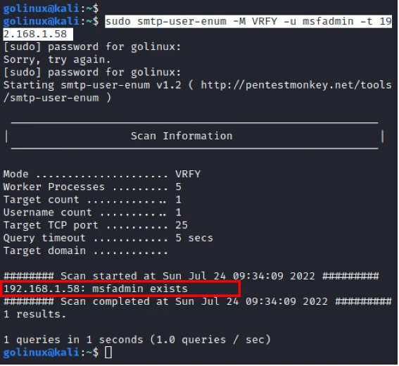
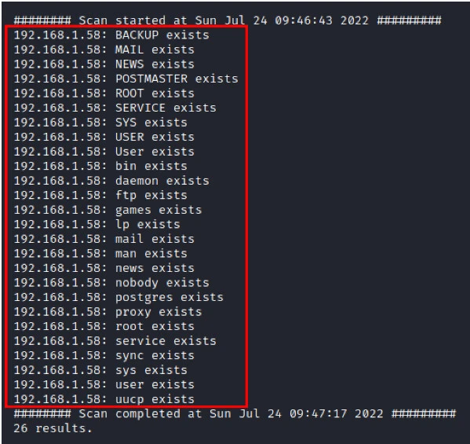
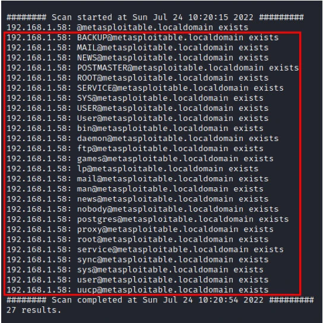
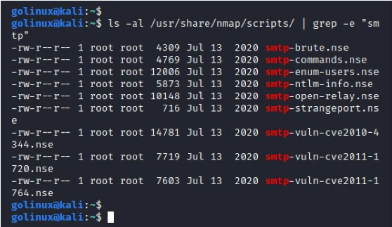
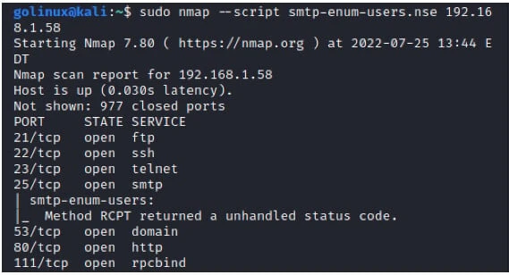
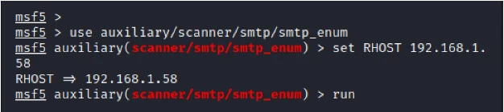
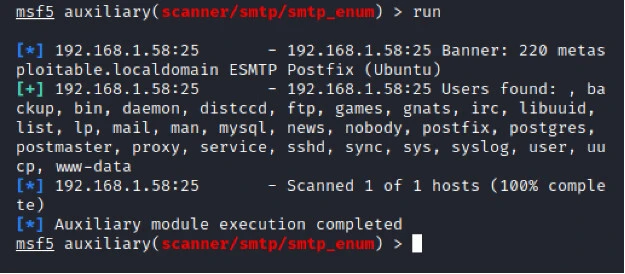

# SMTP 枚举实战指南 [100% 有效]

> **作者：**heuctf 
> **更新日期：** 2026年 4月 10日  
> **分类：** 安全 (Security)  
> **标签：** `#security`

-----

## 目录

  * [SMTP 协议简介](https://www.google.com/search?q=%23smtp-%E5%8D%8F%E8%AE%AE%E7%AE%80%E4%BB%8B)
  * [为什么要进行 SMTP 枚举？](https://www.google.com/search?q=%23%E4%B8%BA%E4%BB%80%E4%B9%88%E8%A6%81%E8%BF%9B%E8%A1%8C-smtp-%E6%9E%9A%E4%B8%BE)
  * [环境准备](https://www.google.com/search?q=%23%E7%8E%AF%E5%A2%83%E5%87%86%E5%A4%87)
  * [核心 SMTP 命令](https://www.google.com/search?q=%23%E6%A0%B8%E5%BF%83-smtp-%E5%91%BD%E4%BB%A4)
  * [SMTP 枚举工具与脚本](https://www.google.com/search?q=%23smtp-%E6%9E%9A%E4%B8%BE%E5%B7%A5%E5%85%B7%E4%B8%8E%E8%84%9A%E6%9C%AC)
      * [使用 smtp-user-enum](https://www.google.com/search?q=%23%E4%BD%BF%E7%94%A8-smtp-user-enum-%E5%91%BD%E4%BB%A4)
      * [使用 Nmap 脚本](https://www.google.com/search?q=%23%E4%BD%BF%E7%94%A8-nmap-%E8%BF%9B%E8%A1%8C-smtp-%E6%9E%9A%E4%B8%BE)
      * [使用 Metasploit 框架](https://www.google.com/search?q=%23%E4%BD%BF%E7%94%A8-metasploit-%E8%BF%9B%E8%A1%8C-smtp-%E6%9E%9A%E4%B8%BE)
  * [总结](https://www.google.com/search?q=%23%E6%80%BB%E7%BB%93)

-----

## SMTP 协议简介

**SMTP** 代表 **简单邮件传输协议（Simple Mail Transfer Protocol）**。它是一种仅用于在 TCP/IP 网络上通过 **25 端口**发送电子邮件的网络协议。这里使用“仅用于”是因为我们还有 POP3 和 IMAP 协议负责接收邮件。由于其普及性，在渗透测试或 CTF 挑战中，你极大概率会遇到此服务。

-----

## 为什么要进行 SMTP 枚举？

SMTP 默认运行在 25 端口。如果 SMTP 服务配置不当或服务器存在漏洞，我们可以实现以下目标：

1.  **枚举并收集用户账户**。
2.  如果存在 **Open Relay（开放中继）**，我们可以绕过身份验证发送邮件。
3.  获取的用户名可以进一步用于 **SSH 登录**、**Web 登录**或**暴力破解**。

-----

## 环境准备

> **警告：** 未经许可，严禁对任何系统进行此类操作。建议在虚拟渗透测试实验室中练习。
> 本文使用 **Metasploitable 2** 虚拟机作为目标。它预装了包括 SQL 注入和 SMTP 枚举在内的多种漏洞。

-----

## 核心 SMTP 命令

在枚举过程中，我们主要利用以下三个命令：

  * **VRFY**：用于验证和检查用户（邮箱）是否存在。
  * **EXPN**：揭示别名的投递地址及邮件列表。
  * **RCPT TO**：定义消息的接收者。

-----

## SMTP 枚举工具与脚本

### 1\. 使用 smtp-user-enum 命令

这是最流行的 SMTP 枚举工具。它通过 VRFY、EXPN 和 RCPT TO 命令来探测用户。

**安装命令：**

```bash
sudo apt install smtp-user-enum
```

**通用语法：**
`smtp-user-enum [选项] (-u 用户名 | -U 用户名列表) (-t 目标IP)`

#### 单用户枚举

使用小写 `-u` 参数检查特定用户（例如 `msfadmin`）是否存在：

```bash
sudo smtp-user-enum -M VRFY -u msfadmin -t 192.168.1.58
```
 
 
> **结果：** 如果返回结果显示该用户存在，说明该用户名是有效的。

#### 多用户枚举（字典攻击）

使用大写 `-U` 参数配合 Kali 自带的字典：

```bash
sudo smtp-user-enum -M VRFY -U /usr/share/wordlists/metasploit/common_roots.txt -t 192.168.1.58
```


#### 枚举有效邮件地址

使用 `-D` 参数指定邮件域名来查找完整的邮件地址：

```bash
sudo smtp-user-enum -M VRFY -D metasploitable.localdomain -U /usr/share/wordlists/metasploit/common_roots.txt -t 192.168.1.58
```
 
 
-----

### 2\. 使用 Nmap 进行 SMTP 枚举

Nmap 不仅是端口扫描器，还拥有强大的 NSE 脚本库。
**列出所有 SMTP 相关脚本：**

```bash
ls -al /usr/share/nmap/scripts/ | grep -e "smtp"
```
 
 
**使用 `smtp-enum-users.nse` 脚本：**

```bash
nmap --script smtp-enum-users.nse 192.168.1.58
```
 
 
-----

### 3\. 使用 Metasploit 进行 SMTP 枚举

Metasploit 拥有专门的辅助模块（Auxiliary）来进行枚举。

1.  **启动控制台：** `sudo msfconsole`
2.  **选择模块：**
    ```bash
    use auxiliary/scanner/smtp/smtp_enum
    ```
3.  **设置目标并运行：**
    ```bash
    set RHOST 192.168.1.58
    run
    ```
 
> **结果：** Metasploit 会自动尝试多种方法并列出所有发现的用户名和邮箱。
 
-----

## 总结

本文详细介绍了使用 Nmap、Metasploit 和 `smtp-user-enum` 进行 SMTP 枚举的方法。实验证明，**smtp-user-enum** 和 **Metasploit** 的准确率相对更高。

**安全加固建议：**
管理员应通过禁用 `EXPN`、`VRFY` 和 `RCPT TO` 命令的执行来正确配置邮件服务器，防止敏感的内部用户信息泄露。
