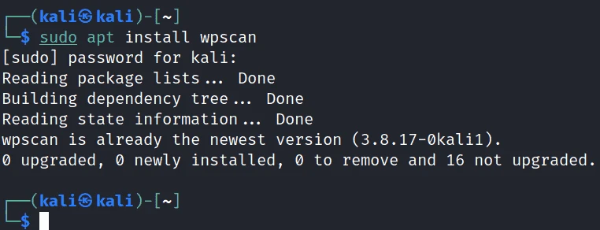
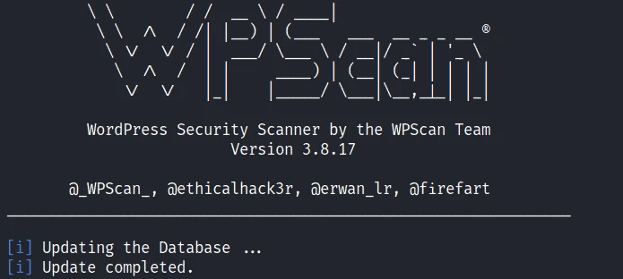
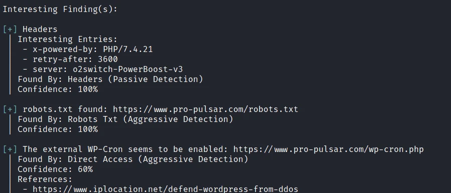
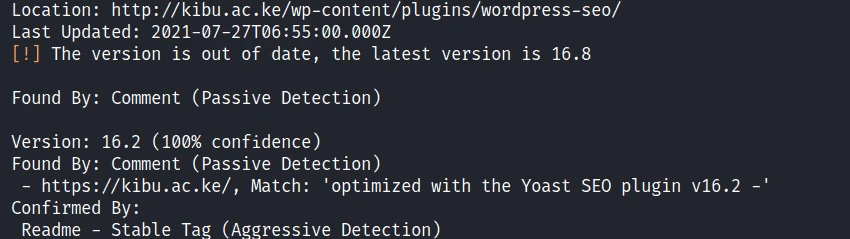
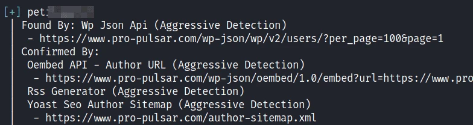
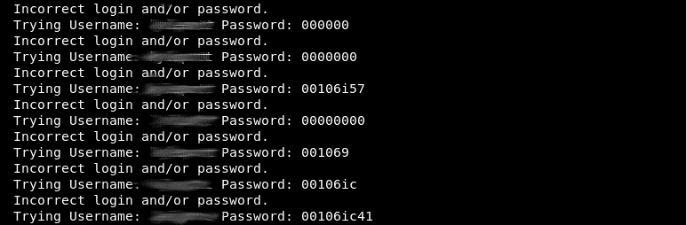

# WPScan：WordPress 漏洞扫描全攻略 [5 步教学]

> **作者：** heuctf
> **更新日期：** 2026年 4月 10日
> **分类：** 安全 (Security)
> **标签：** `#kali_linux`, `#security`

-----

## 目录

  * [什么是 WPScan？](https://www.google.com/search?q=%23%E4%BB%80%E4%B9%88%E6%98%AF-wpscan)
  * [环境准备](https://www.google.com/search?q=%23%E7%8E%AF%E5%A2%83%E5%87%86%E5%A4%87)
  * [第一步：在 Kali Linux 上安装 WPScan](https://www.google.com/search?q=%23%E7%AC%AC%E4%B8%80%E6%AD%A5%E5%9C%A8-kali-linux-%E4%B8%8A%E5%AE%89%E8%A3%85-wpscan)
  * [第二步：更新数据库并执行基础扫描](https://www.google.com/search?q=%23%E7%AC%AC%E4%BA%8C%E6%AD%A5%E6%9B%B4%E6%96%B0%E6%95%B0%E6%8D%AE%E5%BA%93%E5%B9%B6%E6%89%A7%E8%A1%8C%E5%9F%BA%E7%A1%80%E6%89%AB%E6%8F%8F)
  * [第三步：扫描存在漏洞的主题和插件](https://www.google.com/search?q=%23%E7%AC%AC%E4%B8%89%E6%AD%A5%E6%89%AB%E6%8F%8F%E5%AD%98%E5%9C%A8%E6%BC%8F%E6%B4%9E%E7%9A%84%E4%B8%BB%E9%A2%98%E5%92%8C%E6%8F%92%E4%BB%B6)
  * [第四步：使用 WPScan 枚举 WordPress 用户](https://www.google.com/search?q=%23%E7%AC%AC%E5%9B%9B%E6%AD%A5%E4%BD%BF%E7%94%A8-wpscan-%E6%9E%9A%E4%B8%BE-wordpress-%E7%94%A8%E6%88%B7)
  * [第五步：使用 WPScan 暴力破解登录密码](https://www.google.com/search?q=%23%E7%AC%AC%E4%BA%94%E6%AD%A5%E4%BD%BF%E7%94%A8-wpscan-%E6%9A%B4%E5%8A%9B%E7%A0%B4%E8%A7%A3%E7%99%BB%E5%BD%95%E5%AF%86%E7%A0%81)
  * [总结](https://www.google.com/search?q=%23%E6%80%BB%E7%BB%93)

-----

## 什么是 WPScan？

截至 2021 年，全球 39.5% 的网站（超过 6400 万个）由 WordPress 驱动。在所有使用内容管理系统（CMS）的网站中，WordPress 占据了 60% 的份额。显然，它是网页开发中最流行的 CMS。然而，这引发了一个核心担忧：**你的 WordPress 网站安全吗？**

**WPScan** 是一款专门针对 WordPress 的漏洞扫描器（渗透测试工具）。它利用自 2014 年以来建立的 **WPScan 漏洞数据库**，扫描 WordPress 核心程序、插件和主题中的已知风险。该数据库由安全专家和社区持续更新，目前包含超过 21,000 个已知漏洞。

> **注意：** 开发者应定期使用 WPScan 扫描自建站点。除了密码暴力破解外，WPScan 本身不会对网站造成破坏，但它揭示的信息（如 Apache/NGINX 的目录列表泄露）极易被黑客利用。

-----

## 环境准备

  * 你必须拥有一个运行中的 **Kali Linux** 环境。

-----

## 第一步：在 Kali Linux 上安装 WPScan

在 Kali Linux 的完整版中，WPScan 通常是预装的。如果没有，请运行：

```bash
$ sudo apt update
$ sudo apt install wpscan
```

-----

## 第二步：更新数据库并执行基础扫描

WPScan 的使用非常直接：调用工具 -\> 添加参数 -\> 目标 URL。

> **注：** 本文以 `http://yourSite.com` 作为示例域名，请替换为你的目标站点。

```bash
$ wpscan --url http://yoursite.com
```

首次运行时，它会自动更新漏洞数据库。扫描完成后，它会输出以下信息：


  * 服务器环境信息
  * `xmlrpc.php` 和 `wp-cron.php` 的可访问性
  * WordPress 版本号
  * `Robots.txt` 文件内容
  * 当前启用的主题和插件
  * 发现的备份配置文件

**排错提示：** 如果遇到 “Scan Aborted: The target is responding with a 403 (被防火墙/WAF拦截)”，请尝试使用随机 User-Agent：

```bash
$ wpscan --url http://yoursite.com --random-user-agent
```

-----

## 第三步：扫描存在漏洞的主题和插件

基础扫描仅列出插件，不会告诉你它们是否存在漏洞。为此，你需要 **WPScan API 令牌**。

1.  在 [wpscan.com](https://wpscan.com/register) 注册，获取免费 API 令牌（每日 25 次请求）。
2.  使用以下命令扫描**有漏洞的插件**（`-e vp` 代表 Enumerate Vulnerable Plugins）：

<!-- end list -->

```bash
$ wpscan --url http://yourSite.com -e vp --api-token 你的TOKEN
```

要扫描**有漏洞的主题**，请将参数改为 `-e vt`：

```bash
$ wpscan --url http://yourSite.com -e vt --api-token 你的TOKEN
```

-----

## 第四步：使用 WPScan 枚举 WordPress 用户

枚举用户名可以防范大多数密码攻击。如果黑客不知道用户名，他们甚至无法开始暴力破解。

```bash
$ wpscan --url http://yourSite.com -e u
```

`u` 代表 Users。WPScan 会通过分析博文作者、URL 等技术提取用户名。

**安全建议：** 不要让登录名和显示在文章上的“公开名称”一致。

-----

## 第五步：使用 WPScan 暴力破解登录密码

拿到用户名后，你可以配合字典（Wordlist）进行暴力破解。你可以使用 Kali 自带的字典 `/usr/share/wordlists`，或用 **Crunch** 生成。

```bash
# 语法：--passwords 后面跟着字典路径
$ wpscan --url http://yourSite.com --passwords /path/to/wordlist.txt
```

> **重要提示：** 暴力破解会对服务器造成较大压力。在进行渗透测试前，必须获得管理员授权。

-----

## 总结

WordPress 复杂的插件和主题生态增大了受攻击面。从服务器配置到第三方插件的安全性，每一个环节都至关重要。WPScan 是测试这些环节的必备利器，它能帮助你先于黑客发现并修复漏洞。

-----

**相关阅读：**

  * [如何使用 Crunch 生成字典]
  * [Kali Linux 渗透测试基础]
