# Web 应用渗透测试 Top 5 模糊测试工具

> **作者：** Deepak Prasad
> **更新日期：** 2024 年 4 月 21 日
> **分类：** 安全 (Security)
> **标签：** `#security`

---

## 目录
* 模糊测试的工作原理
* 模糊测试的不同类型
* Web 应用模糊测试步骤
* 1. Ffuf
* 2. Dirb
* 3. GoBuster
* 4. WFuzz
* 5. Dirsearch
* 总结

---

## 概述
在本文中，我们将学习 5 款令人惊叹的模糊测试工具，它们可供 Web 应用渗透测试员用于模糊测试。模糊测试是一门在黑客技术中永不过时的艺术：当你发现一个空白页面时，你会进行模糊测试；当你一无所获时，你仍会进行模糊测试。让我们学习如何使用这些出色的工具来自动化我们的模糊测试流程。


### 模糊测试的工作原理
模糊测试（Fuzzing）是一种自动化的过程，它通过向 Web 应用提供输入，以发现这样做是否会产生任何成功或奇怪的结果。模糊测试能以惊人的方式揭示“如果...会怎样”的情况。一些模糊测试工具使用随机字符、字符串，而另一些则针对性地使用词表（Wordlists）。Web 应用渗透测试员大多使用他们最擅长的自定义词表来测试目标。市场上各种工具琳琅满目，因此你需要根据需求选择合适的工具。

### 模糊测试的不同类型
* **应用级模糊测试（Application Fuzzing）：** 本文的核心部分。主要针对桌面应用、URL、表单和 RPC 请求。通过词表、字符串和随机字符向应用发送请求并等待响应。
* **协议级模糊测试（Protocol Fuzzing）：** 协议模糊器向目标应用发送伪造的数据包，并通过即时修改请求并转发来充当代理。
* **文件格式模糊测试（FileFormat Fuzzing）：** 相对简单，即向工具提供应用的合法文件样本。模糊器会对样本进行变异并在目标应用中打开。一旦某个样本导致崩溃，数据将被保存以供审查。如果能控制崩溃时的执行流，你就可能掌握应用的控制权。

---

## Web 应用模糊测试步骤
1.  **确定数据入口点：** 找出 Web 应用的数据输入点，如参数、目录甚至脚本。
2.  **选择优秀的词表：** 一个好的词表能创造奇迹。我建议在测试 Web 应用时使用 **SecLists** 词表。
3.  **开始模糊测试：** 下载你偏好的工具，提供入口点和词表开始测试。

---

## 1. Ffuf
**Ffuf** (Fuzz Fast You Fool) 是一款用 Go 编写的开源工具，以其速度、灵活性和高效性成为市场上最好的工具之一。其更新频率极高，被全球渗透测试员和 Bug 猎人广泛使用。其递归能力和正则匹配功能深受青睐。

### 1.1 Ffuf 安装
**Linux:**
```bash
git clone https://github.com/ffuf/ffuf
cd ffuf
go get
go build
```
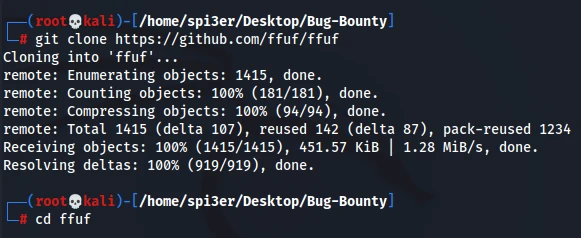
**Mac OS:** `brew install ffuf`

**Kali:** `sudo apt install ffuf`
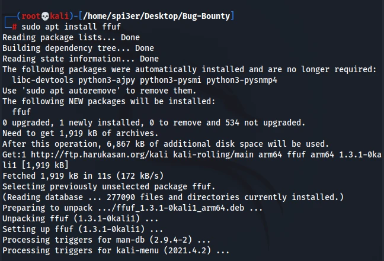
### 1.2 Ffuf 用法示例
**基础模糊测试：**
```bash
ffuf -c -w /path/to/wordlist -u http://example.com/FUZZ
```
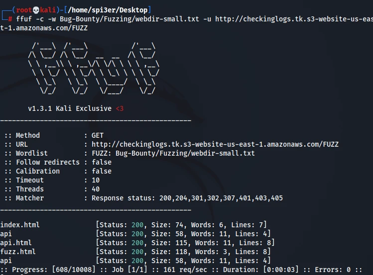
**匹配特定响应码：**
```bash
ffuf -c -w /path/to/wordlist -u http://example.com/FUZZ -mc 200,401,402,403
```
**启用递归模式：**
```bash
ffuf -c -w /path/to/wordlist -u http://example.com/FUZZ -recursion
```
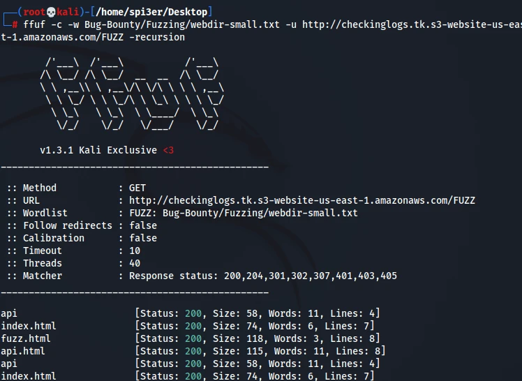
---

## 2. Dirb
经典的 **Dirb** 是一款命令行工具，通过分析响应来查找 Web 服务器上现有的文件或目录。它预装了一套词表，也支持自定义词表。

### 2.1 Dirb 安装
**Ubuntu:** `sudo apt install dirb`
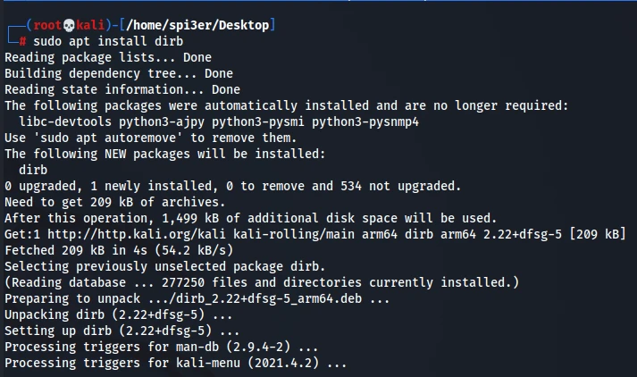
### 2.2 Dirb 用法示例
**基础命令：**
```bash
dirb http://example.com /path/to/wordlist
```
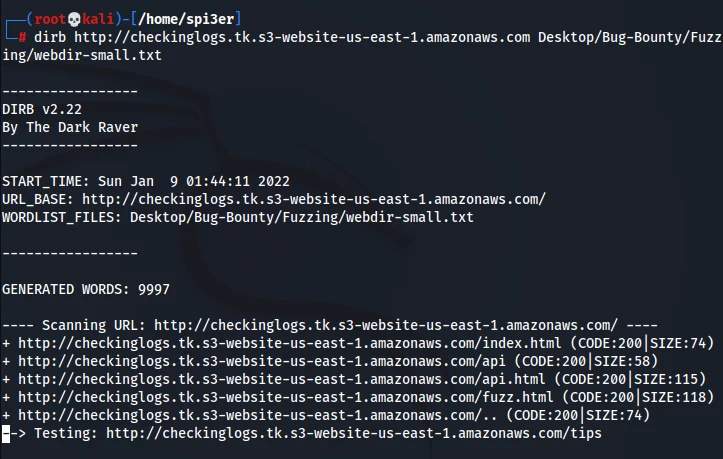
**静默模式（减少冗余输出）：**
```bash
dirb http://example.com -S
```
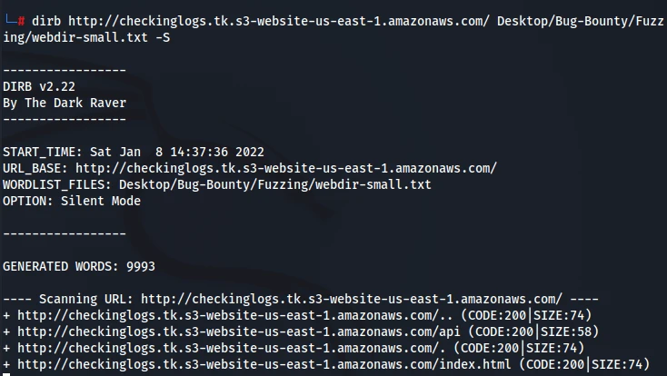
---

## 3. GoBuster
**GoBuster** 同样由 Go 编写，比 Dirb 和 Dirbuster 快得多，支持多线程并发处理。它可用于爆破 URI、S3 存储桶、DNS 子域名等。
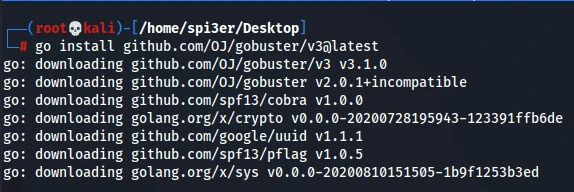
### 3.1 GoBuster 安装
**Linux:** `go install github.com/OJ/gobuster/v3@latest`  
**Ubuntu/Kali:** `sudo apt install gobuster`
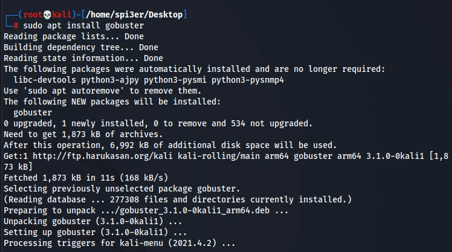
### 3.2 GoBuster 用法示例
**目录爆破：**
```bash
gobuster dir -u http://example.com/ -w /path/to/wordlist
```
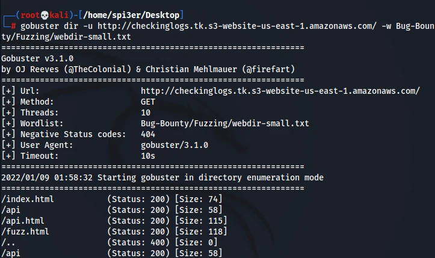
**指定文件扩展名：**
```bash
gobuster dir -u http://example.com/ -w /path/to/wordlist -x html,php
```
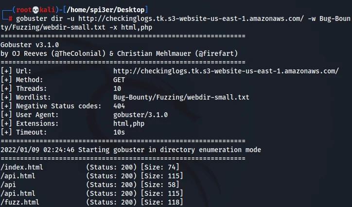
---

## 4. WFuzz
**WFuzz** 是一款基于 Python 的命令行工具，专门为 Web 应用评估而设计。它的核心理念是将 `FUZZ` 关键字替换为给定的 Payload。它拥有丰富的插件，可用于 Payload 生成、编解码等。

### 4.1 WFuzz 安装
**Ubuntu/Kali:**
```bash
sudo apt-get install wfuzz
```
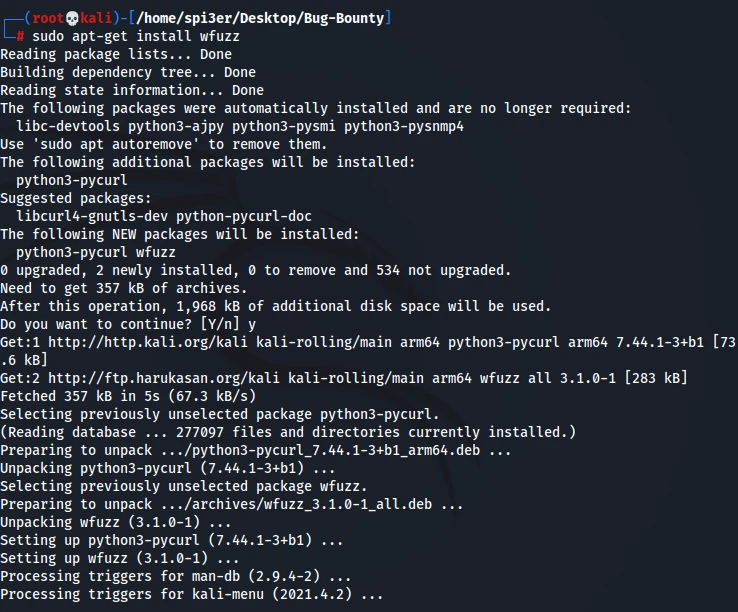
### 4.2 WFuzz 用法示例
**隐藏 404 响应进行模糊测试：**
```bash
wfuzz --hc 404 -w /path/to/wordlist http://example.com/FUZZ
```
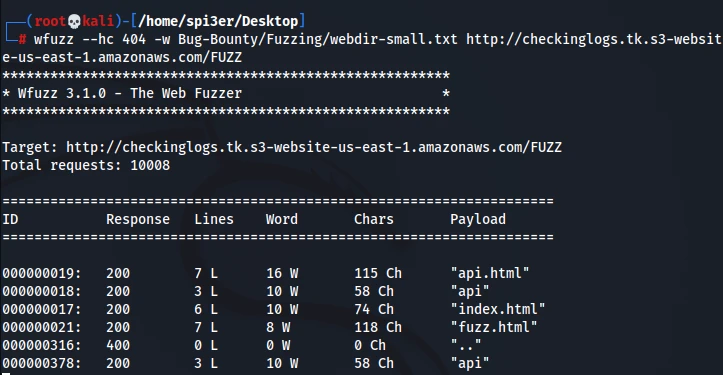
**爆破用户名和密码：**
```bash
wfuzz -c -z file,users.txt -z file,pass.txt --sc 200 http://www.site.com/log.asp?user=FUZZ&pass=FUZ2Z
```

---

## 5. Dirsearch
**Dirsearch** 是另一款优秀的基于 Python 的工具，用于爆破目录和文件。它支持多线程和递归模糊测试，是渗透测试员的常备工具。

### 5.1 Dirsearch 安装
**Ubuntu/Kali/Mac:** `pip3 install dirsearch`
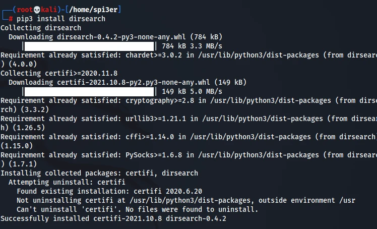
### 5.2 Dirsearch 用法示例
**基础测试：**
```bash
dirsearch -w /path/to/wordlist -u http://example.com/
```
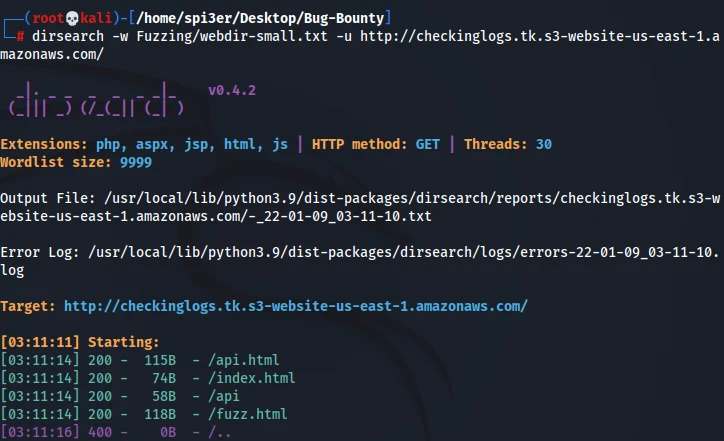
**导出结果到文件：**
```bash
dirsearch -w /path/to/wordlist -u http://example.com/ -o output.txt
```
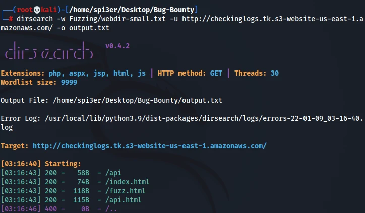
---

## 总结
本文介绍了 Web 应用渗透测试中排名前五的模糊测试工具。这些工具非常关键，我建议在测试中至少结合使用其中的两种。如果你在执行命令时遇到问题，请在评论区告诉我们。
