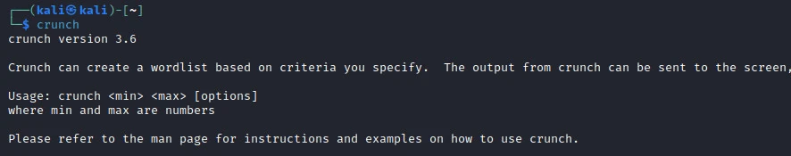
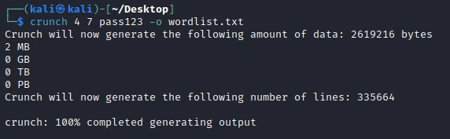
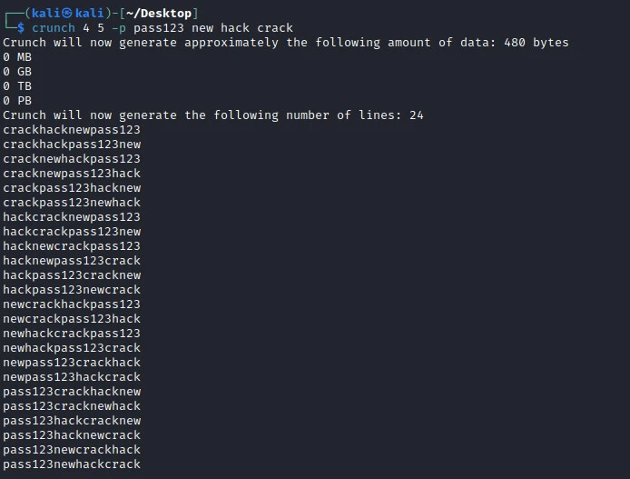
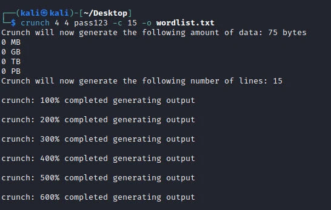
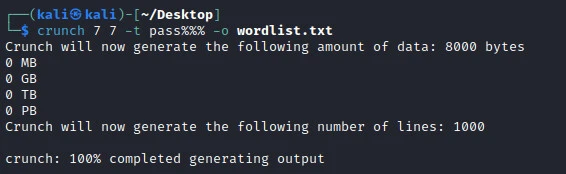
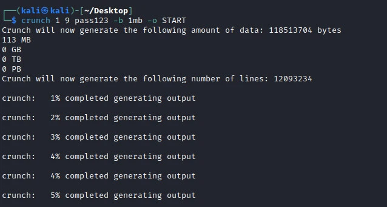
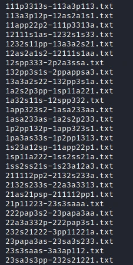
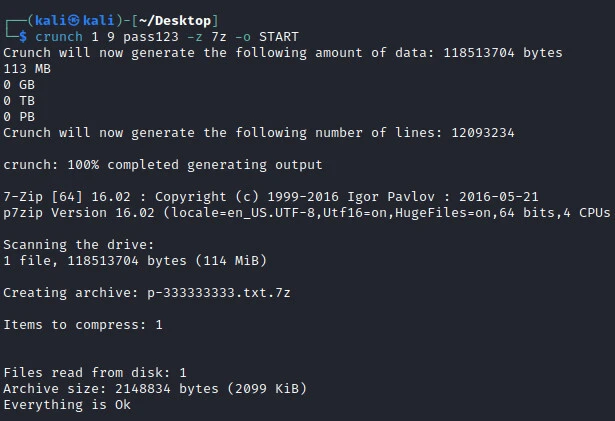

---

# 使用 Crunch 生成密码字典 [6 种方法]

> **作者：** heuctf
> **发布日期：** 2026年 4月 10 日
> **分类：** 安全 (Security)
> **标签：** `#security`

---

## 概述
各位学习者大家好，在我们之前的指南中，我们学习了如何使用 **hashview** 从预定义的字典中破解密码哈希。在本指南中，我们将学习如何使用 **Crunch**（一款开源软件）来生成包含可能密码组合的字典。虽然使用网上提供的字典（如 **Seclists**）破解哈希或尝试暴力攻击可能会在解密密码时徒劳无功，但这正是 Crunch 的用武之地。当我们对密码的长相有一定线索时，Crunch 会非常有帮助。

---

## 要求
* 运行 Kali Linux 的个人电脑。
* 具备使用终端的知识。
* 对可能的密码结构有一定的线索。

---

## Crunch 字典生成器
Crunch 是一款预装在各种 Linux 发行版中的实用程序。安全专业人员使用 Crunch 生成预定义的字典，以满足用户在破解密码时的需求。Crunch 的一些功能包括：
* Crunch 可以生成排列（Permutation）和组合（Combination）两种方式的字典。
* Crunch 模式（Pattern）支持使用数字和符号。
* 可在 Windows 和 Linux 上运行。
* 用户在生成多个文件时可以添加状态报告。
* 它可以按照命令定义拆分输出（即按文件大小或行数拆分）。
* 你可以恢复（Resume）字典生成任务。
* 拥有全新的 `-l` 选项，用于对 `@, % ^` 的字面支持。
* 拥有全新的 `-d` 选项，用于限制重复字符。
* 支持 Unicode。
* Crunch 模式可以分别支持大写和小写字符。

---

## 安装
为了在 Kali Linux 上安装 Crunch，我们运行以下命令：
```bash


sudo apt-get install crunch
```
要查看 Crunch 是否已安装，我们可以运行以下命令：
```bash
crunch
```

---

## 如何使用 Crunch 作为字典生成器

### Crunch 选项
Crunch 拥有我们可以用来生成符合需求字典的选项。这些选项是：
* **-b:** 指定字典的最大容量。
* **-c:** 指定写入字典的行数。
* **-d:** 限制重复字符的数量。
* **-e:** 在达到某个特定字符串时停止生成。
* **-f:** 从 `charset.lst` 文件中指定字符集列表。
* **-i:** 反转字典中的字符顺序。
* **-l:** 在使用 `-t` 时，允许对 `%, @ ^` 进行字面解释。
* **-o:** 指定输出字典文件。
* **-p:** 打印不含重复字符的排列。
* **-q:** 类似于 `-p` 选项，但它从指定文件中读取字符串。
* **-r:** 恢复之前的会话（不能与 `-s` 同时使用）。
* **-s:** 指定字典开始的特定字符串。
* **-t:** 设置 `@, % ^` 的特定模式。
* **-z:** 压缩输出字典文件，需配合 `-o` 使用。

**模式符号说明：**
* **@** 代表小写字母
* **^** 代表特殊字符
* **%** 代表数字
* **,** 代表大写字母

---

## 使用 Crunch 生成密码
Crunch 允许我们生成包含至少一个数值和一个字母值的字典。要使用 Crunch 生成此类组合，我们运行以下命令：
```bash
crunch <min> <max> <character set> -o <outputfile>
```
其中 **min** 是最小密码长度，**max** 是最大密码长度，**character set** 是用于生成密码的字符集，**output file** 指定了我们要保存生成密码的文件。

### 生成字母数字字典
在某些情况下，人们更喜欢使用字母和数字组合作为密码。在这种情况下生成密码时，我们的字符集将同时包含数字和字母，如下所示。



如上图所示，我们生成了 335,664 个可能的密码。

### 使用排列（Permutation）生成字典
如果我们确定某个短语被用于我们要破解的密码中，我们可以使用 `-p` 标志来指定该短语，以便将其包含在我们生成的字典中。Crunch 还允许我们在生成字典时包含多个短语。排列之间应以空格分隔，如下图所示。



### 生成限制行数的字典
Crunch 有一个选项允许我们生成指定行数的字典。例如，如果我们只需要 1000 个可能的密码组合中的前 100 行。为了实现这一点，我们在指定字符集后添加 `-c` 标志，后跟我们需要的行数，如下图所示。



### 使用特定模式生成字典
有些人可能更喜欢使用具有特定模式的密码。例如，一个短语后跟数字的密码。Crunch 提供了一个选项，通过使用 `-t` 标志在生成可能的密码时指定模式。为此，我们使用上面讨论过的特殊字符。例如，如果用户的密码是一个短语后跟一个或多个数字，我们可以使用以下命令。



### 字典碎片化（文件拆分）
字典碎片化选项在生成的字典大小很大（跨越数兆字节甚至数千兆字节）时非常有用。在生成字典时使用 `-b` 标志，将根据我们为每个字典文件设置的最大容量将字典拆分为多个文件，如下图所示。


从我们的工作目录中，可以看到我们生成的多个字典。

在使用 `-b` 标志拆分字典文件时，我们需要在输出标志（`-o`）之后添加 **START**。

### 生成压缩字典
在生成非常大的字典时，或者在需要将字典传输到另一台 PC 上使用的情况下，可能需要压缩字典。为了压缩生成的字典，我们将添加 `-z` 标志并指定我们想要的压缩文件类型：`bzip2`, `gzip`, `7z` 以及 `lzma`。

---


## 结论
在上述指南中，我们学习了根据我们要破解的密码性质，生成包含可能密码组合字典的不同技术。使用 Crunch，我们能够生成符合我们需求的字典，从而节省大量时间。虽然 Crunch 可以用来生成可能的密码组合，但其效率取决于我们是否对要生成的密码结构有线索。通过使用 Crunch 和 hashview，我们可以破解许多常用密码的哈希。
