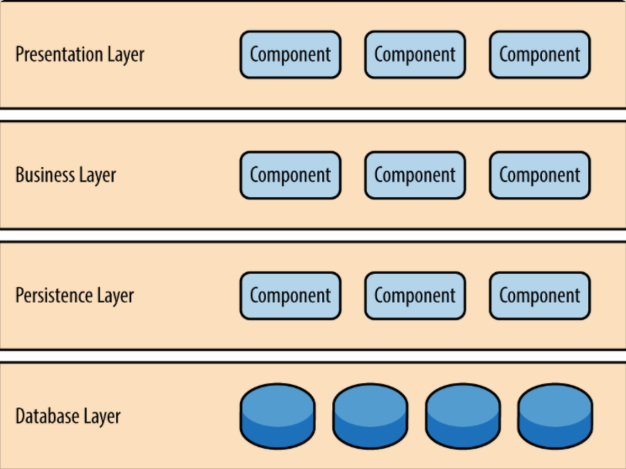
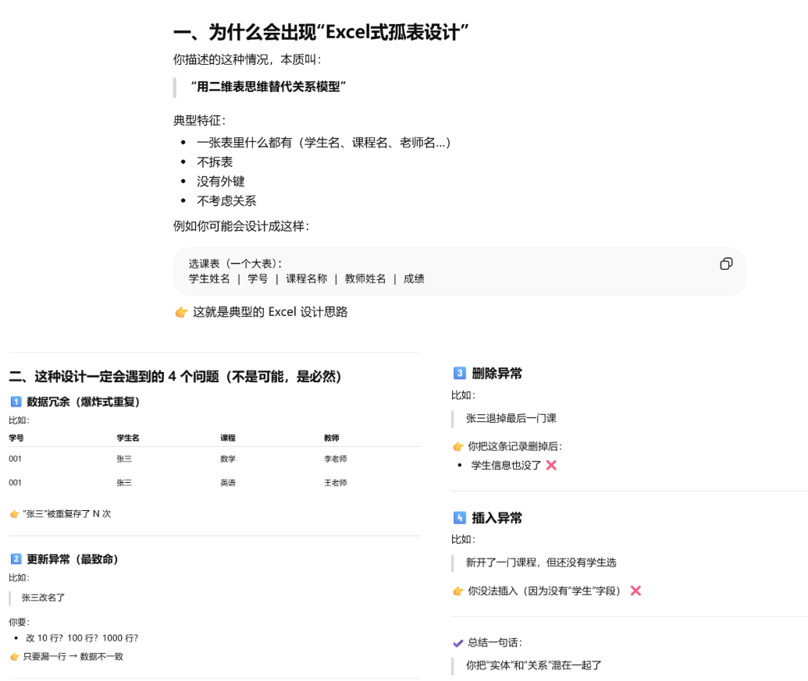
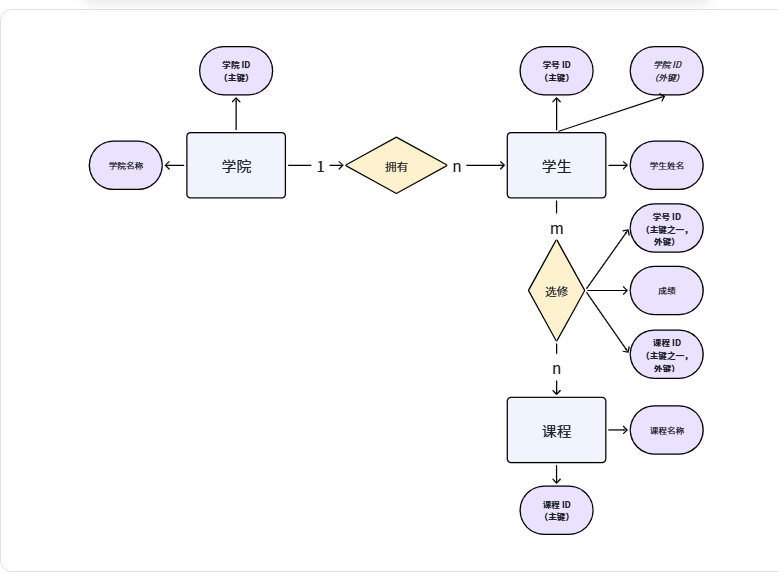
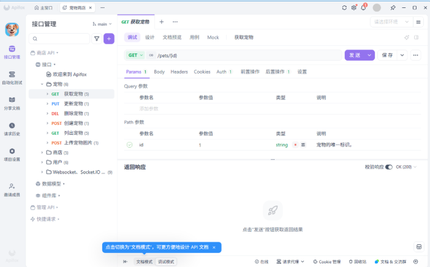
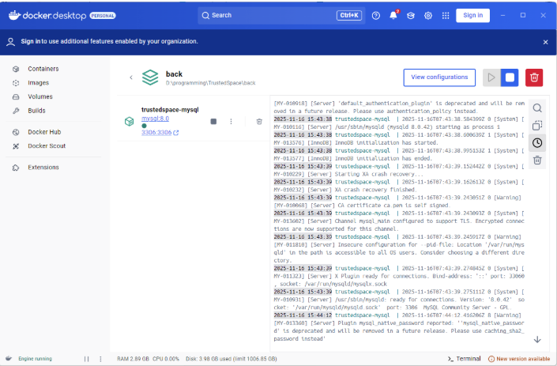

前置基础
- AI Coding 实现的前后端编程基础：Codex
- 服务器基础使用与网站部署：0011 服务器使用
本节目标
- 业务流程图
- 功能项划分与边界
- 介绍简单的架构设计（知识点）
- 详细介绍数据库设计（知识点）
- 前后端开发基础：02前后端加法器的实现
- AI 开发时有哪些需要注意的事项（技巧）
- 绘图工具分享（技巧）
- 文档撰写与快速排版（技巧）
入门架构设计
分层架构
- 参考资料：https://www.ruanyifeng.com/blog/2016/09/software-architecture.html
分层架构（layered architecture）是最常见的软件架构，也是事实上的标准架构。如果你不知道要用什么架构，那就用它。
这种架构将软件分成若干个水平层，每一层都有清晰的角色和分工，不需要知道其他层的细节。层与层之间通过接口通信。
虽然没有明确约定，软件一定要分成多少层，但是四层的结构最常见。

- 表现层（presentation）：用户界面，负责视觉和用户互动
  - 前端界面设计
  - 前端网络请求封装
- 业务层（business）：实现业务逻辑
  - 后端接口设计
  - 后端接口内部模块设计
- 持久层（persistence）：提供数据，SQL 语句就放在这一层，在实际开发中，我们一般使用 ORM 框架
  - 数据库表定义
  - 对数据库的增删改查
- 数据库（database） ：保存数据
  - Docker 容器化部署
数据库设计
以学生选课系统为例：
- 一个学院有多名学生，一个学生只能归属在一个学院。
- 每个学生可以选修多门课程，而一门课程也可以有多个学生选修。
- 学生选修了课程后，就会有对应的课程成绩。
为什么不能草率直接建表
- 参考资料：https://chatgpt.com/s/t_69d4e7f8e3048191bc237b0438576b23

实体与关系——ER 图
- 实体：表示现实世界中可区分的对象。
- 关系：一对一（1：1）、一对多（1：n）或多对多（m：n）
- 属性：每个实体可以有多个属性，用于描述其特征。
- 主键：主键是表中的一个或一组字段，用于唯一标识表中的每一行数据。主键的值必须是唯一的，并且不能为NULL。
- 外键：是表的一个字段，不是本表的主键，但对应另一个表的主键。外键用于建立和加强两个表之间的链接，确保数据的参照完整性。

建表
依据上图，完成建表。
学院表
字段名
数据类型
主/外键
学院 ID

主键
学院名称

-
学生表
字段名
数据类型
主/外键
学生 ID

主键
姓名

-
学院 ID

外键
课程表
字段名
数据类型
主/外键
课程 ID

主键
课程名

-
选修表
字段名
数据类型
主/外键
学生 ID

主键
外键
课程 ID

成绩

-
总结
- 每个实体对应一张表
- 多对多关系需要再建一张表，取两个实体的主键，作为其外键和共同主键
- 1 对多关系不需要建表，只需要取 1 对应的实体的主键作为 n 的外键即可
AI 开发技巧分享
前端
- 不要弄蓝紫色渐变风
- 不要弄大幅度圆角
- 追求扁平化设计、简约、大气
后端
- 接口明确，一定要写好接口文档
- 注意上下文别超，发给 AI 文档的时候，先让其完善框架，再完善接口，再完善内部设计
- 工具分享：Apifox

数据库
- Docker 容器化部署，记得运行前要启动 Docker
- 先做好 ER 图，再进行表设计，写好文档
- 使用 ORM 框架
- 镜像源参考：
{
  "builder": {
    "gc": {
      "defaultKeepStorage": "20GB",
      "enabled": true
    }
  },
  "experimental": false,
  "features": {
    "buildkit": true
  },
  "live-restore": true,
  "registry-mirrors": [
    "https://hub-mirror.c.163.com",
    "https://mirror.ccs.tencentyun.com",
    "https://docker.mirrors.tuna.tsinghua.edu.cn",
    "https://docker.1panel.live",
    "https://hub.rat.dev",
    "https://docker.anyhub.us.kg",
    "https://dockerhub.jobcher.com",
    "https://docker.kejilion.pro",
    "https://docker.xuanyuan.me"
  ]
}
- 配置参考：
数据库这里使用 gorm 库来与数据库进行连接，先是使用 SQLite 做技术验证，完全可行；之后又使用 MySQL 采用 Docker 部署，同样完全可行。
下面是 gorm 库与 SQLite 的对接：
package database

import (
    "log"
    "time"
    "gorm.io/driver/sqlite"
    "gorm.io/gorm"
)

// BaseModel 包含公共字段
type BaseModel struct {
    CreateTime time.Time `gorm:"autoCreateTime:true"` // 创建时间
    UpdateTime time.Time `gorm:"autoUpdateTime:true"` // 更新时间
}

// 定义数据库模型
// 管理员表 administrators
type Administrator struct {
    AdministratorId int64  `gorm:"primaryKey"` // 管理员ID(主键)
    Name            string // 姓名
}

var DB *gorm.DB

// InitDB 初始化数据库连接
func InitDB() error {
    db, err := gorm.Open(sqlite.Open("yuketang.db"), &gorm.Config{})
    if err != nil {
        return err
    }
    
    DB = db
    // 自动迁移表结构
    err = db.AutoMigrate(
        &Administrator{},
    )
    if err != nil {
        return err
    }

    log.Println("数据库初始化成功")
    return nil
}

下面是进行数据库的操作：
// 将user对象插入到数据库中
// 如果数据库中没有该用户，balance设为----，其余默认；如果有该用户，则
var existingUser database.User
database.DB.Where("user_id = ?", user.UserId).First(&existingUser)
if existingUser.UserId == 0 {
    user.Balance = int64(初始化金额变量) // 转换为int64类型
    mainlogger.Printf("输出日志")
    database.DB.Create(&user)
} else {
    // 保留用户原来的余额
    user.Balance = existingUser.Balance
    // 后面的内容省略不写
    database.DB.Save(&user)
}
下面是 gorm 库与 MySQL 的对接：
package database

import (
    "back/models"
    "back/util"
    "fmt"
    "log"
    "os"
    "time"
    "gorm.io/driver/mysql"
    "gorm.io/gorm"
    "gorm.io/gorm/logger"
)

// DB 全局数据库连接
var DB *gorm.DB

// 初始化数据库
func init() {
    dsn := "trustedspace:trustedspace123@tcp(localhost:3306)/trustedspace?charset=utf8mb4&parseTime=True&loc=Local"
    var err error

    // 设置标准Logger
    newLogger := logger.New(
        log.New(os.Stdout, "\r\n", log.LstdFlags), // 使用标准输出
        logger.Config{
            SlowThreshold: time.Second, // 慢SQL阈值
            LogLevel:      logger.Info, // 日志级别
            Colorful:      false,       // 禁用彩色日志
        },
    )

    // 连接数据库
    DB, err = gorm.Open(mysql.Open(dsn), &gorm.Config{
        Logger: newLogger,
    })

    if err != nil {
        util.LogError("数据库连接失败: %v", err)
        panic("数据库连接失败")
    }

    // 设置连接池
    sqlDB, err := DB.DB()
    if err != nil {
        util.LogError("获取数据库连接失败: %v", err)
        panic("获取数据库连接失败")
    }

    // 设置最大空闲连接数
    sqlDB.SetMaxIdleConns(10)
    // 设置最大打开连接数
    sqlDB.SetMaxOpenConns(100)
    // 设置连接的最大生命周期
    sqlDB.SetConnMaxLifetime(time.Hour)

    // 自动迁移数据表结构
    migrateDB()

    util.LogInfo("数据库连接成功")
}

// 自动迁移数据表结构
func migrateDB() {
    // 自动创建或更新数据表结构
    err := DB.AutoMigrate(
        &models.User{},
        &models.Resource{},
        &models.ResourceTag{},
        &models.DataResource{},
        &models.ComputingResource{},
        &models.AlgorithmResource{},
        &models.Publication{},
        &models.Transaction{}, // 添加交易记录模型迁移
        &models.ResourceFavorite{}, // 添加资源收藏模型迁移
        &models.ResourcePurchase{}, // 添加资源购买记录表
    )

    if err != nil {
        util.LogError("数据表自动迁移失败: %v", err)
        panic(fmt.Sprintf("数据表自动迁移失败: %v", err))
    }

    util.LogInfo("数据表自动迁移完成")
} 

绘图工具分享
- Canva：https://www.canva.cn/
- 飞书
- PPT
- Codex：直接生成 HTML 格式
我这边有份好看的样式参考，可以让 AI 仿写
<!DOCTYPE html>
<html lang="zh">
<head>
    <meta charset="UTF-8">
    <meta name="viewport" content="width=device-width, initial-scale=1.0">
    <title>智信链枢 · 创新能力可视化展示</title>
    <!-- 引入 ECharts -->
    
    
    
</head>
<body>
    

        <!-- 在市场现状分析和模块一之间添加设计思路部分 -->
        

            <h2 class="module-title">设计思路</h2>
            

                

                    

                        

                            <svg xmlns="http://www.w3.org/2000/svg" fill="none" viewBox="0 0 24 24" stroke="#10b981">
                                <path stroke-linecap="round" stroke-linejoin="round" stroke-width="2" d="M13 10V3L4 14h7v7l9-11h-7z" />
                            </svg>
                        

                        <h3 class="threat-title">聚合与协同</h3>
                        
整合数据、算法、算力资源，实现多要素协同。

                    

                    

                        

                            <svg xmlns="http://www.w3.org/2000/svg" fill="none" viewBox="0 0 24 24" stroke="#6366f1">
                                <path stroke-linecap="round" stroke-linejoin="round" stroke-width="2" d="M12 11c0 3.517-1.009 6.799-2.753 9.571m-3.44-2.04l.054-.09A13.916 13.916 0 008 11a4 4 0 118 0c0 1.017-.07 2.019-.203 3m-2.118 6.844A21.88 21.88 0 0015.171 17m3.839 1.132c.645-2.266.99-4.659.99-7.132A8 8 0 008 4.07M3 15.364c.64-1.319 1-2.8 1-4.364 0-1.457.39-2.823 1.07-4" />
                            </svg>
                        

                        <h3 class="threat-title">可信与透明</h3>
                        
基于区块链技术，确保全流程可追溯。

                    

                    

                        

                            <svg xmlns="http://www.w3.org/2000/svg" fill="none" viewBox="0 0 24 24" stroke="#ec4899">
                                <path stroke-linecap="round" stroke-linejoin="round" stroke-width="2" d="M9 12l2 2 4-4m5.618-4.016A11.955 11.955 0 0112 2.944a11.955 11.955 0 01-8.618 3.04A12.02 12.02 0 003 9c0 5.591 3.824 10.29 9 11.622 5.176-1.332 9-6.03 9-11.622 0-1.042-.133-2.052-.382-3.016z" />
                            </svg>
                        

                        <h3 class="threat-title">安全可控</h3>
                        
沙箱技术实现"数据可用不可见"。

                    

                    

                        

                            <svg xmlns="http://www.w3.org/2000/svg" fill="none" viewBox="0 0 24 24" stroke="#f59e0b">
                                <path stroke-linecap="round" stroke-linejoin="round" stroke-width="2" d="M13 7h8m0 0v8m0-8l-8 8-4-4-6 6" />
                            </svg>
                        

                        <h3 class="threat-title">便捷易用</h3>
                        
算法插件化设计，降低使用门槛。

                    

                

            

        

        <!-- 市场威胁分析 -->
        

            <h2 class="threats-title">数据要素市场面临的三大威胁</h2>
            

                

                    

                        <svg xmlns="http://www.w3.org/2000/svg" fill="none" viewBox="0 0 24 24" stroke="#ef4444">
                            <path stroke-linecap="round" stroke-linejoin="round" stroke-width="2" d="M12 15v2m-6 4h12a2 2 0 002-2v-6a2 2 0 00-2-2H6a2 2 0 00-2 2v6a2 2 0 002 2zm10-10V7a4 4 0 00-8 0v4h8z" />
                        </svg>
                    

                    <h3 class="threat-title">信任难题</h3>
                    
数据提供方担心数据泄露，使用方质疑数据真实性，平台监管难以保障。

                

                

                    

                        <svg xmlns="http://www.w3.org/2000/svg" fill="none" viewBox="0 0 24 24" stroke="#f59e0b">
                            <path stroke-linecap="round" stroke-linejoin="round" stroke-width="2" d="M4 7v10c0 2.21 3.582 4 8 4s8-1.79 8-4V7M4 7c0 2.21 3.582 4 8 4s8-1.79 8-4M4 7c0-2.21 3.582-4 8-4s8 1.79 8 4m0 5c0 2.21-3.582 4-8 4s-8-1.79-8-4" />
                        </svg>
                    

                    <h3 class="threat-title">资源割裂</h3>
                    
数据、算法、算力资源分散在不同平台，协作效率低下。

                

                

                    

                        <svg xmlns="http://www.w3.org/2000/svg" fill="none" viewBox="0 0 24 24" stroke="#3b82f6">
                            <path stroke-linecap="round" stroke-linejoin="round" stroke-width="2" d="M9 3v2m6-2v2M9 19v2m6-2v2M5 9H3m2 6H3m18-6h-2m2 6h-2M7 19h10a2 2 0 002-2V7a2 2 0 00-2-2H7a2 2 0 00-2 2v10a2 2 0 002 2zM9 9h6v6H9V9z" />
                        </svg>
                    

                    <h3 class="threat-title">使用门槛高</h3>
                    
缺乏即用型数据分析环境，非专业用户难以有效利用资源。

                

            

        

        <!-- 市场现状分析 -->
        

            <h2 class="module-title">市场现状与不足分析</h2>
            

                

                
注：当前市场存在的主要问题及具体表现

            

        

        <!-- 模块一：可信管控 -->
        

            <h2 class="module-title">一、可信管控 —— 安全与透明</h2>
            
            <!-- 流程图 -->
            

                

                
注：基于区块链的全流程可信管控

            

            <!-- 能力对比图 -->
            

                

                
注：与传统方案的核心能力对比

            

            <!-- 六边形能力图 -->
            

                

                
智信链枢安全可信特性

            

        

        <!-- 模块二：资源交互 -->
        

            <h2 class="module-title">二、资源交互 —— 一站式整合</h2>
            
            <!-- 树图 -->
            

                

                
智信链枢资源聚合生态

            

            <!-- 漏斗图 -->
            

                

                
一站式资源整合流程

            

        

        <!-- 模块三：价值共创 -->
        

            <h2 class="module-title">三、价值共创 —— 丰富资源生态</h2>
            
            <!-- 桑基图 -->
            

                

            

            <!-- 生态参与者图 -->
            

                    

                
生态参与者协同网络

                

            <!-- 平台优势图 -->
            

                    

                
平台优势特性

            

        

    

    
</body>
</html> 
文档撰写与快速排版
- 飞书：用于软件开发过程文档管理，使用 MD 语法即可
- 排版：Codex + LaTeX
我这边做好了模板，可以直接在上面改