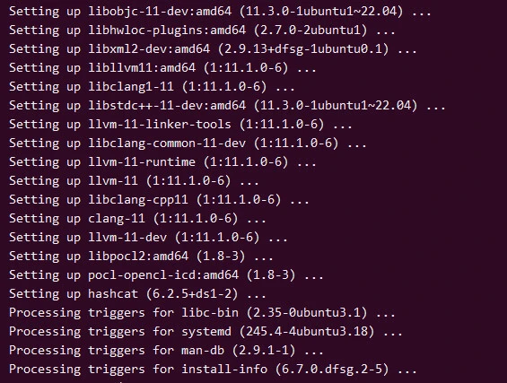
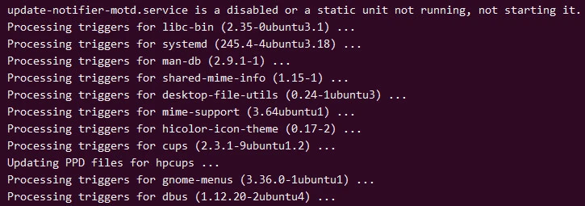
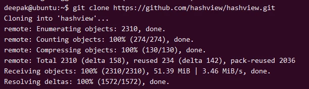
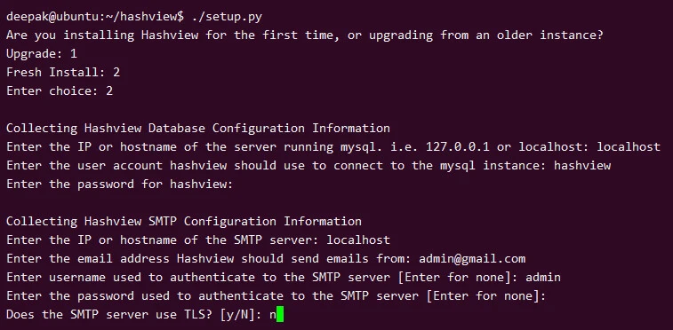
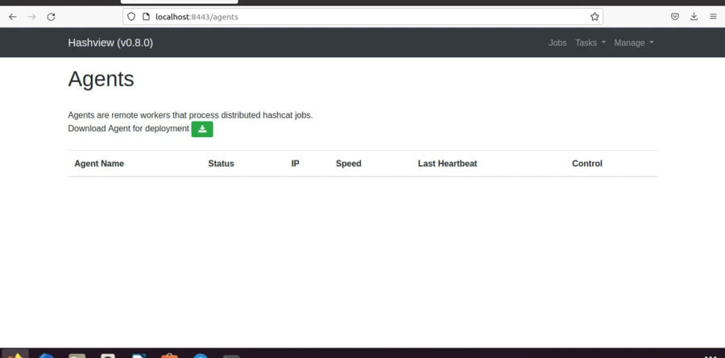
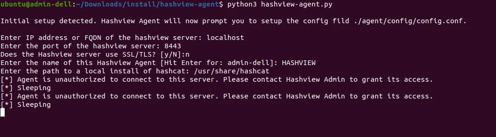
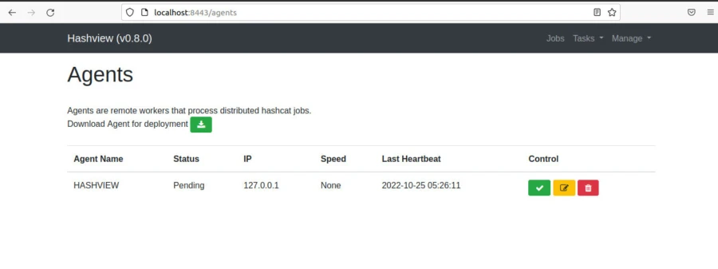
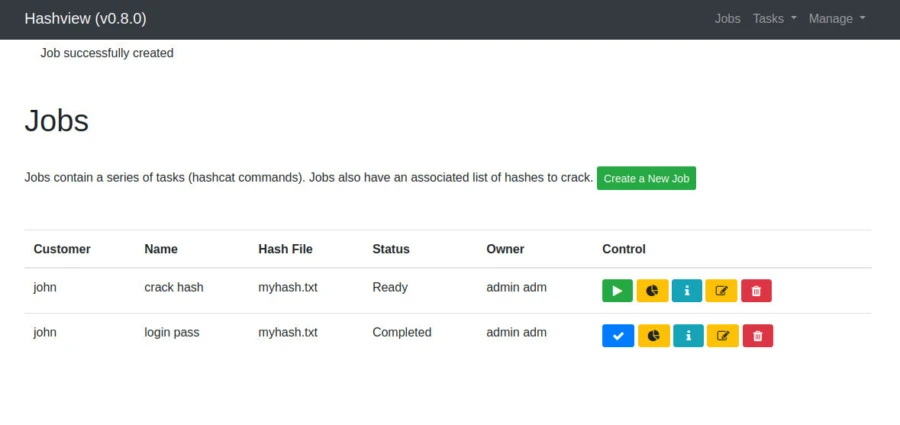
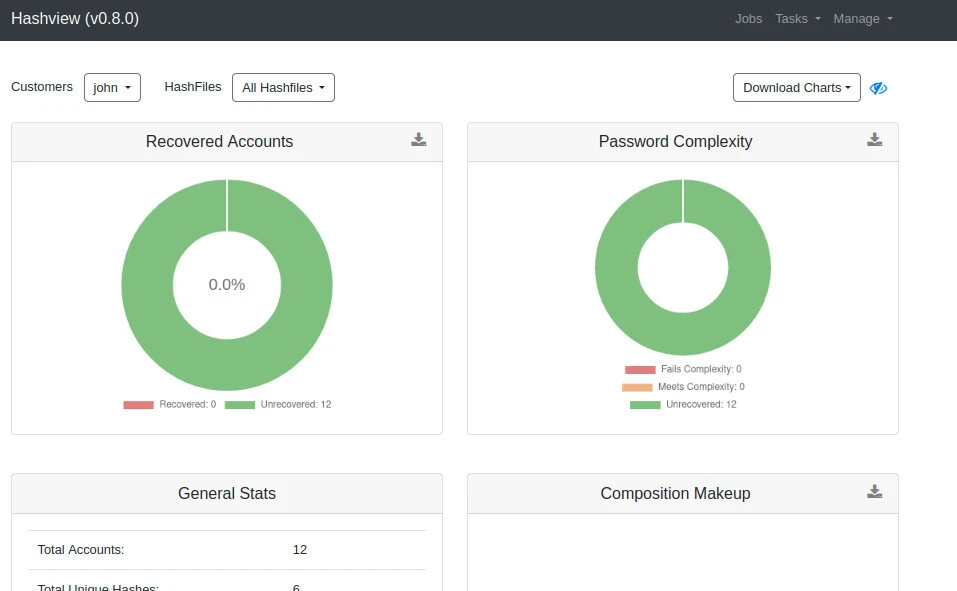

# 如何使用 Hashview 破解哈希 [分步指南]
> **作者：** heuctf
> **更新日期：** 2026年 4月 10日  
> **分类：** 安全 (Security)  
> **标签：** `#security`

-----

## 本页内容

  * [要求](https://www.google.com/search?q=%23%E8%A6%81%E6%B1%82)
  * [Hashcat 概述](https://www.google.com/search?q=%23hashcat-%E6%A6%82%E8%BF%B0)
  * [安装 Hashcat](https://www.google.com/search?q=%23%E5%AE%89%E8%A3%85-hashcat)
      * [Hashcat 命令行安装](https://www.google.com/search?q=%23hashcat-%E5%91%BD%E4%BB%A4%E8%A1%8C%E5%AE%89%E8%A3%85)
  * [安装 Hashview](https://www.google.com/search?q=%23%E5%AE%89%E8%A3%85-hashview)
      * [第一步：安装 MySQL](https://www.google.com/search?q=%23step-1-%E5%AE%89%E8%A3%85-mysql)
      * [第二步：配置 MySQL](https://www.google.com/search?q=%23step-2-%E9%85%8D%E7%BD%AE-mysql)
      * [第三步：安装 Hashview 服务端](https://www.google.com/search?q=%23step-3-%E5%AE%89%E8%A3%85-hashview-%E6%9C%8D%E5%8A%A1%E7%AB%AF)
      * [第四步：安装 Hashview 代理端 (Agent)](https://www.google.com/search?q=%23step-4-%E5%AE%89%E8%A3%85-hashview-%E4%BB%A3%E7%90%86%E7%AB%AF)
      * [第五步：开始破解哈希](https://www.google.com/search?q=%23step-5-%E5%BC%80%E5%A7%8B%E7%A0%B4%E8%A7%A3%E5%93%88%E5%B8%8C)
  * [结论](https://www.google.com/search?q=%23%E7%BB%93%E8%AE%BA)

-----

与加密不同，哈希是不可逆的。要从哈希中“检索”出原文，唯一的技术就是：对密码进行知情猜测，将其通过哈希算法处理，然后将输出结果与你已有的哈希进行比对。目前用于破解哈希的工具非常先进；**John the Ripper** 和 **Hashcat** 共同提供了大量的哈希类型支持，包括各种卓越的功能和极佳的执行优化，正如你对这项耗时任务所期望的那样。

然而归根结底，主要的挑战在于硬件而非软件。在本指南中，我们将演示如何安装并使用 **Hashview**，通过对照单词表（Wordlist）检查密码哈希来完成破解。

## 要求

  * 运行 **Ubuntu** 的个人电脑。
  * 包含待破解哈希的文件。
  * 一个单词表 (Wordlist)。
  * 具备使用终端的知识。

-----

## Hashcat 概述

这是一款密码破解工具，可用于破解某些最复杂的密码格式。为了实现这一目标，它提供了多功能性、高效性以及多种破解特定密码的方法。Hashcat 还支持使用预生成的字典、暴力破解甚至彩虹表技术，以提高效率。

**Hashcat 的核心特性包括：**

  * 破解时支持多线程。
  * 支持各种常见操作系统（Linux, Windows, OSX）和多种哈希类型。
  * 会话可以停止并自动恢复。
  * 支持十六进制文件（hex-charset 和 hex-salt）。
  * 线程可以根据优先级进行配置和执行。
  * 实现了 90 多种算法的性能优化。
  * 支持多种哈希算法（MD4, MD5, SHA1, MySQL 等）。

-----

## 安装 Hashcat

在破解之前，我们需要安装 Hashcat。Hashcat 既可以通过命令行界面使用，也可以通过 **Hashview** 使用——后者是 Hashcat 的 Web 版本，具有命令行版所不具备的附加功能。

### Hashcat 命令行安装

安装非常简单。首先确保系统包是最新的：

```bash
sudo apt update
sudo apt upgrade
```

更新完成后，通过 apt 安装：

```bash
sudo apt install hashcat
```

-----

## 安装 Hashview

安装 Hashview 与 Hashcat 不同。Hashview 实际上是带有图形用户界面的 Hashcat。使用 Hashview 时，用户无需记住繁琐的命令，只需提供哈希文件、单词表及其他必要信息即可。我们需要先安装**服务端 (Server)**，然后添加**代理端 (Agent)**。

### Step-1: 安装 MySQL

Hashview 使用 MySQL 数据库，因此我们需要先安装它：

```bash
sudo apt install mysql-server
sudo service mysql start
sudo mysql_secure_installation
```

### Step-2: 配置 MySQL

安装完成后，为 Hashview 创建一个专用数据库账户：

> **注意：** 虽然可以使用 root 账户，但在生产环境中建议使用低权限账户。

执行以下命令：

```bash
sudo mysql
```

在 MySQL 提示符下：

```sql
CREATE USER 'yourusername'@'localhost' IDENTIFIED BY 'YOURPASSWORD!';
GRANT ALL PRIVILEGES ON hashview.* TO 'hashview'@'localhost';
FLUSH PRIVILEGES;
CREATE DATABASE hashview;
```

### Step-3: 安装 Hashview 服务端

安装必要的 Python 依赖：

```bash
sudo apt-get install python3 python3-pip python3-flask
```

从 GitHub 克隆项目：

```bash
git clone https://github.com/hashview/hashview.git
cd hashview
pip install -r requirements.txt
```

运行设置脚本并提供数据库信息：

```bash
./setup.py
```

设置完成后，启动服务器。通过浏览器访问 `http://localhost:8443` 并登录。

### Step-4: 安装 Hashview 代理端

在 Hashview 网页端导航至 **Agents** 选项下载代理程序。解压并安装依赖：

```bash
tar -xzvf hashview-agent.0.8.0.tgz
cd hashview-agent
pip install -r requirements.txt
python3 hashview-agent.py
```

在代理配置中提供服务端信息。返回网页端的 Agents 页面，点击 **Allow** 允许该代理。

### Step-5: 开始破解哈希

代理就绪后，前往 **Jobs** 页面创建任务：

1.  上传哈希文件。
2.  设置任务名称和客户信息。
3.  选择要使用的单词表 (Wordlist)。
4.  启动任务。

你可以通过仪表盘查看实时分析，包括已破解哈希的数量和未找到的哈希。你还可以将结果下载为文本文件。

-----

## 结论

通过本指南，我们成功安装并使用了 Hashview。虽然 Hashview 和 Hashcat 是极其先进的工具，但其效率很大程度上取决于硬件性能。使用包含常用密码的高质量单词表可以显著提升破解效率。在下一篇文章中，我们将学习如何生成自定义单词表。
