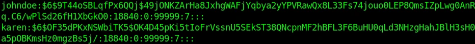

# 密码破解工具 - John The Ripper (JTR) 实战案例

> **作者：** heuctf
> **更新日期：** 2026年 4月 10日
> **分类：** 安全 (Security)
> **标签：** `#kali_linux`, `#passwd`, `#security`

-----

## 目录

  * [John The Ripper 简介](https://www.google.com/search?q=%23john-the-ripper-%E7%AE%80%E4%BB%8B)
  * [什么是密码哈希（Hashes）？](https://www.google.com/search?q=%23%E4%BB%80%E4%B9%88%E6%98%AF%E5%AF%86%E7%A0%81%E5%93%88%E5%B8%8Chashes)
  * [使用 John the Ripper 破解密码的原理](https://www.google.com/search?q=%23%E4%BD%BF%E7%94%A8-john-the-ripper-%E7%A0%B4%E8%A7%A3%E5%AF%86%E7%A0%81%E7%9A%84%E5%8E%9F%E7%90%86)
  * [环境准备](https://www.google.com/search?q=%23%E7%8E%AF%E5%A2%83%E5%87%86%E5%A4%87)
  * [密码破解模式](https://www.google.com/search?q=%23%E5%AF%86%E7%A0%81%E7%A0%B4%E8%A7%A3%E6%A8%A1%E5%BC%8F)
      * [单一模式 (Single Mode)](https://www.google.com/search?q=%231-%E5%8D%95%E4%B8%80%E6%A8%A1%E5%BC%8F-single-mode-password-cracking)
      * [字典模式 (Wordlist Mode)](https://www.google.com/search?q=%232-%E5%AD%97%E5%85%B8%E6%A8%A1%E5%BC%8F-wordlist-cracking-mode)
      * [增量模式 (Incremental Mode)](https://www.google.com/search?q=%233-%E5%A2%9E%E9%87%8F%E6%A8%A1%E5%BC%8F-incremental-password-cracking-mode)
  * [停止与恢复破解任务](https://www.google.com/search?q=%23%E5%81%9C%E6%AD%A2%E4%B8%8E%E6%81%A2%E5%A4%8D%E7%A0%B4%E8%A7%A3%E4%BB%BB%E5%8A%A1)
  * [单词变形规则 (Word Mangling Rules)](https://www.google.com/search?q=%23%E5%8D%95%E8%AF%8D%E5%8F%98%E5%BD%A2%E8%A7%84%E5%88%99-word-mangling-rules)
  * [使用 JtR 破解 Zip 文件密码](https://www.google.com/search?q=%23%E4%BD%BF%E7%94%A8-jtr-%E7%A0%B4%E8%A7%A3-zip-%E6%96%87%E4%BB%B6%E5%AF%86%E7%A0%81)
  * [总结](https://www.google.com/search?q=%23%E6%80%BB%E7%BB%93)

-----

## John The Ripper 简介

**John The Ripper (JTR)** 是最受欢迎的密码破解工具之一，预装在大多数渗透测试 Linux 发行版（如 Kali Linux, Parrot OS 等）中。该工具在多次网络安全演示中大放异彩，最著名的案例之一是 Varonis 事件响应团队曾使用它进行取证。JtR 以其**友好的命令行界面**和**自动检测绝大多数密码哈希类型**的能力而闻名。本教程将深入探讨 JtR 的工作原理，并解释为什么它是安全测试的必备工具。

-----

## 什么是密码哈希（Hashes）？

目前，密码登录是最常用的安全认证方法之一。在大多数安全系统中，当你创建登录密码时，它会以“哈希”格式存储。常见的哈希算法包括 **MD5, SHA-1, SHA-2, NTLM, LANMAN** 等。

例如，如果我设置密码为 `john@2021` 并使用 MD5 算法进行加密，生成的哈希值将是：`5960fe967092ea6724ef5e6adb3ab9c6`。当你尝试登录时，系统会将你输入的密码再次哈希，并将其与数据库中存储的哈希值进行对比。

-----

## 使用 John the Ripper 破解密码的原理

使用 JtR 破解密码是一个**迭代过程**：

1.  从字典中选择一个单词。
2.  使用与目标密码相同的哈希算法对该单词进行哈希。
3.  将生成的哈希值与目标哈希值进行比对。
4.  **匹配成功：** 则该单词即为原始密码。
5.  **匹配失败：** JtR 选取下一个单词重复上述过程。

正如你所料，如果密码非常复杂，这个过程会耗费大量时间。JtR 支持 UNIX 和 Windows 系统中绝大多数加密技术（注：macOS 基于 UNIX）。

-----

## 环境准备

本文将使用现有的 **Kali Linux** 环境进行演示。

-----

## 密码破解模式

JtR 主要支持以下三种破解模式：

### 1\. 单一模式 (Single Mode Password Cracking)



JtR 会尝试利用 UNIX 系统 `/etc/passwd` 文件中 **GECOS** 字段（用户信息字段）里的用户名作为可能的密码组合进行测试。这是最高效的初始攻击方式。

**实战演示：**
在 Linux 系统中，加密后的用户哈希存储在 `/etc/shadow`。

```bash
$ sudo cat /etc/shadow
```

假设我们要破解用户 `johndoe` 和 `Karen` 的密码。为了演示方便，我们将用户名设置为其密码。我们将相关的哈希字段复制并保存到桌面上名为 `shadow.hashes` 的文件中。
使用以下语法进行破解：

```bash
$ sudo john --single shadow.hashes
```

> **输出结果：** JtR 会显示已破解的密码，用户名会显示在括号内。

### 2\. 字典模式 (Wordlist Cracking Mode)

在此模式下，JtR 会尝试字典文件中的所有单词组合。

**实战演示：**
创建一个新用户 `Debian`，密码设为 `secret123`：

```bash
$ sudo useradd Debian
$ sudo passwd Debian
```

将 `/etc/shadow` 中的哈希值保存到 `hashes.txt`。使用 `--wordlist` 参数指定字典路径：

```bash
john --wordlist=/usr/share/wordlists/crypton.txt hashes.txt
```

> **工作原理：** 工具会逐个提取字典中的单词，使用 SHA-512 算法哈希，直到找到匹配项。

### 3\. 增量模式 (Incremental Password Cracking Mode)

这是最强大的**暴力破解攻击**模式。JtR 会尝试所有可能的字符组合。由于它会不断尝试更长的密码长度，因此可能耗时极长。

```bash
$ john --incremental hashes.txt
```

-----

## 停止与恢复破解任务

破解大型复杂密码时，我们可能需要暂停或取消任务。JtR 支持任务恢复功能：

  * **暂停/停止：** 按下键盘上的 `Q` 键或 `Ctrl + C`。
  * **恢复任务：** 使用以下命令从断点处继续：

<!-- end list -->

```bash
$ john --restore
```

-----

## 单词变形规则 (Word Mangling Rules)

当你使用字典模式时，可以设置“变形规则”来扩展单词。例如，如果字典中有单词 `johndoe`，JtR 会根据规则尝试以下变体：

  * `johnDoe` (大小写转换)
  * `JohnDOE`
  * `johndoe123` (末尾添加数字)
  * `@JohnDoe` (添加特殊符号)

启用变形规则后，字典中的每一行都会生成多个候选密码，极大地提高了破解成功率。

-----

## 使用 JtR 破解 Zip 文件密码

要破解 Zip 文件，我们需要先提取其哈希值。

1.  **提取哈希：** 使用 `zip2john` 工具（如果是 RAR 文件，则使用 `rar2john`）。

<!-- end list -->

```bash
$ zip2john protected.zip > zip.hashes
```

2.  **开始破解：** 得到哈希文件后，使用字典模式进行破解：

<!-- end list -->

```bash
$ john --wordlist=/usr/share/wordlists/crypton.txt zip.hashes
```

-----

## 总结

尽管市面上有很多密码破解工具，但 **John the Ripper** 无疑是最优秀、最可靠的工具之一。它经常与其他渗透工具配合使用，用于验证系统漏洞或在受损系统中提升权限。希望本教程能帮助你开启使用 JtR 进行密码破解的大门。

**延伸阅读：**

  * [Hashcat 使用指南]
  * [Kali Linux 基础教程]
