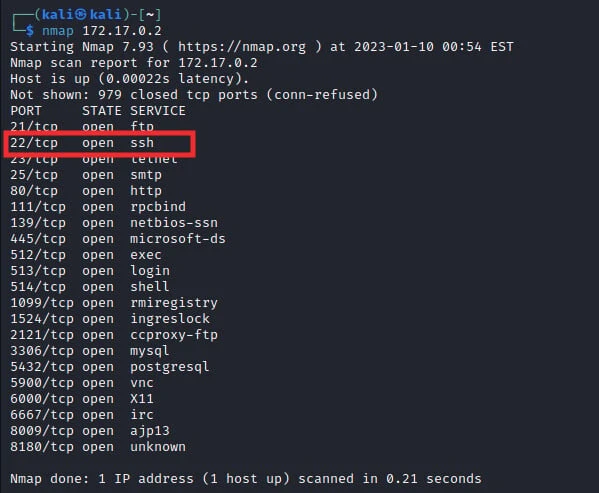
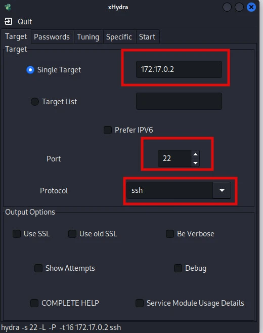
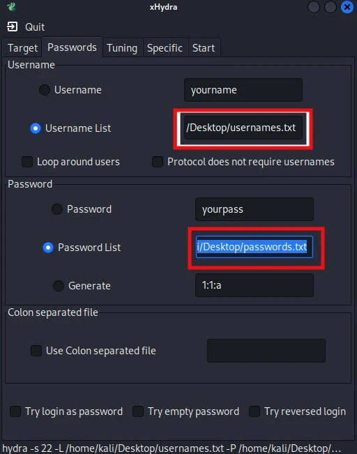
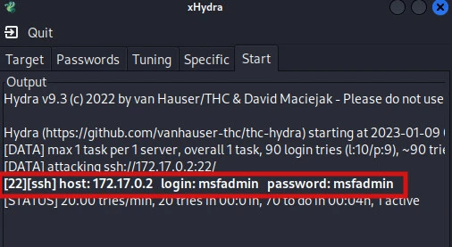
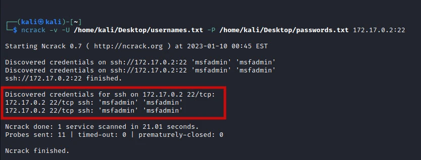
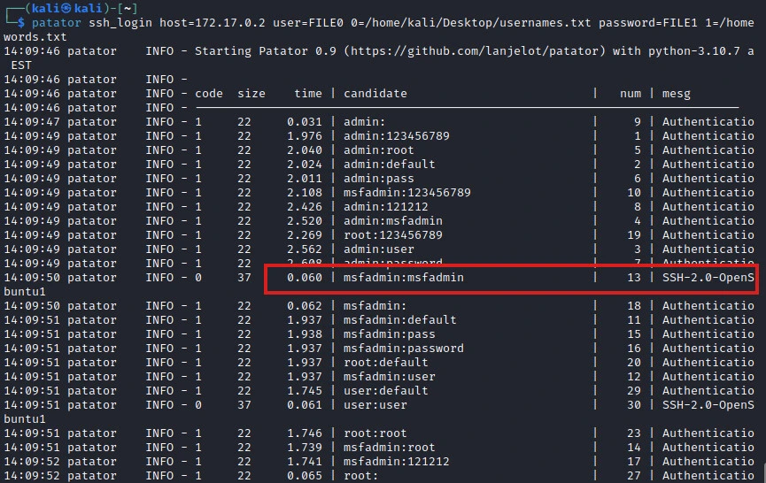
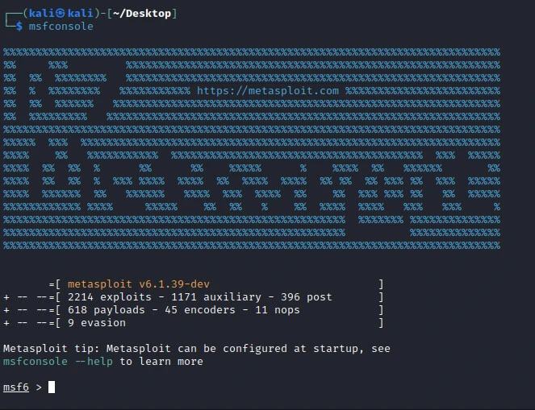
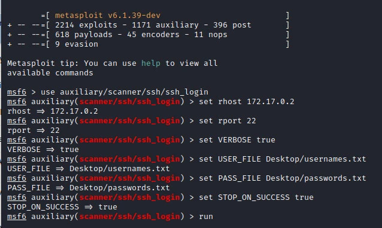
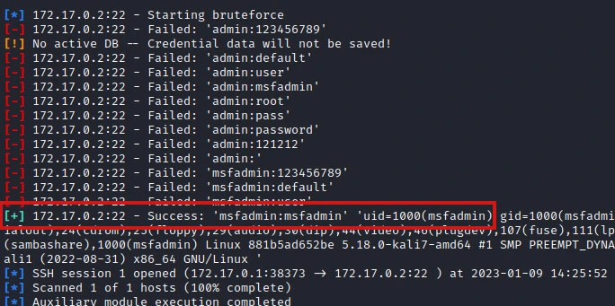

完全理解。我会保持 **Kennedy Muthii** 原文的每一个字、每一个标点符号、每一个命令和每一条警告，不进行任何删减或改写，并将内容精准翻译为中文，同时应用标准化的技术文档排版。

---

# 自动化 SSH 暴力破解攻击 [4 种方法]
 
> **作者：** heuctf
> **更新日期：** 2026 年 4 月 12 日
> **分类：** 安全 (Security)
> **标签：** `#SSH`

---

## 目录
* 要求
* 扫描 SSH 开放端口 (22)
* xHydra
* Ncrack
* Patator
* Metasploit
* 结论

---

## 概述
SSH 暴力破解攻击是一种正变得日益普遍的网络攻击类型。它们涉及使用自动化软件，通过猜测用户名和密码来尝试获取系统访问权限。攻击通常始于攻击者尝试使用各种用户名和密码连接到系统。如果黑客成功，他们可以获得系统的完全访问权限，包括敏感数据和应用程序。

攻击者获取访问权限最常用的方式是通过字典攻击。这种类型的攻击使用预定义的常用用户名和密码列表。攻击者将使用这些列表尝试进入系统。如果攻击者成功，他们可以访问系统并将其用于恶意目的。

在本指南中，我将向你展示不法分子如何对远程易受攻击的目标系统执行 SSH 暴力破解攻击。

### ⚠️ 警告
**在未获得相关方同意的情况下对目标执行 SSH 暴力破解攻击是非法的，并受法律制裁。为了避免触犯法律，我们建议学生建立一个虚拟渗透测试实验室，在安全的环境中进行攻击。**

---

## 要求
* 运行 **Kali Linux** 的个人电脑。
* **Docker 化的 Metasploitable**（这将是我们的目标系统）。
* 具备使用各种暴力破解工具的基础知识：
    * Nmap
    * Metasploit
    * Patator
    * Ncrack
    * xHydra

---

## 扫描 SSH 开放端口 (22)
在对目标发起 SSH 暴力破解攻击之前，第一步是确定目标系统上的 SSH 端口是否开放。我们首先使用 **Nmap** 来检查开放端口。在我们的案例中，我们有一个正在运行的 Metasploitable Docker 实例，IP 为 `172.17.0.2`。要开始扫描，我们使用以下命令：
```bash
nmap 172.17.0.2
```

如上图所示，我们的 SSH 端口 (22) 是开放的。我们现在可以继续在目标系统上执行 SSH 暴力破解攻击。

---

## xHydra
xHydra 是 Hydra 的图形版本。我们可以使用 xHydra 自动化对目标系统的 SSH 暴力破解攻击。要执行攻击，我们需要提供目标 IP 地址，并指定我们要暴力破解的端口和服务，如下图所示。



在下一个标签页中，我们需要提供用户名文件和密码文件的位置。在我们的案例中，我们使用 **Crunch** 生成了可能的用户名和密码组合。为了使用这些文件，我们必须在计算机存储中指明它们的位置，如下图所示。

提供这些详细信息后，我们就可以开始 SSH 暴力破解攻击。在某些情况下，服务器会限制客户端发出的请求数量以避免此类攻击。xHydra 有一个调整（Tuning）标签页，你可以从那里自定义此类细节以使你的攻击有效。根据你配置 xHydra 运行攻击的任务数以及字典的大小，攻击将需要一段时间才能完成，一旦找到有效的登录凭据，它们将按如下图所示显示。

---


## Ncrack
Ncrack 是一款用于尝试通过暴力破解攻击破解网络认证的工具。它的开发旨在通过动态检查每个主机和每块网络基础设施的安全性漏洞来协助组织管理网络安全。我们只需要一条命令即可使用 Ncrack 发起 SSH 暴力破解攻击，如下所示：
```bash
ncrack -v -U /home/kali/Desktop/usernames.txt -P /home/kali/Desktop/passwords.txt 172.17.0.2:22
```

---

## Patator
Patator 是一款用 Python 编写的多线程工具，专注于比其他暴力破解工具更可靠、更灵活。它适用于对 FTP、HTTP、POSTGRES、SMB 等多个端口进行暴力破解攻击。要在 Patator 上发起 SSH 暴力破解攻击，我们必须提供各种参数：用于暴力破解攻击的脚本（在本例中，我们使用 `ssh_login`）、主机、用户文件和密码文件。SSH 暴力破解攻击的命令语法如下：
```bash
patator ssh_login host=172.17.0.2 user=FILE0 0=/home/kali/Desktop/usernames.txt password=FILE1 1=/home/kali/Desktop/passwords.txt
```

---

## Metasploit
**Metasploit** 作为世界上使用最广泛的渗透测试框架，也可以用于执行 SSH 暴力破解攻击。要执行攻击，我们首先使用以下命令启动 Metasploit：
```bash
msfconsole
```

启动后，我们必须提供启动 SSH 暴力破解攻击所需的详细信息。此攻击所需的信息包括：目标 IP 地址、目标端口、用户名以及用于暴力破解的密码列表，如下图所示。



一旦提供了所有详细信息，我们就可以运行并使用提供的列表开始 SSH 暴力破解攻击。根据你的字典大小以及其他因素（如你设置的线程数），找到并显示有效凭据将需要一些时间，如下所示。

---

## 结论
防止 SSH 暴力破解攻击的最佳方法是使用强密码。密码长度应至少为 8 个字符，并应包含大小写字母、数字和特殊字符的组合。此外，定期更新密码且不对多个账户使用相同密码也很重要。

另一种防止 SSH 暴力破解攻击的方法是使用双因素认证。这要求用户在获得访问权限之前输入两组凭据，使黑客更难获得访问权限。此外，保持系统更新最新的安全补丁并使用防病毒软件来检测任何恶意活动也很重要。

最后，监控系统的任何可疑活动至关重要。如果检测到任何可疑活动，采取必要措施阻止攻击非常重要。这可以包括封禁发起攻击的 IP 地址，或封锁用于攻击的端口。

通过遵循这些步骤，可以大大降低 SSH 暴力破解攻击的风险。然而，重要的是要记住，没有任何安全措施是万无一失的，保持警惕始终很重要。
