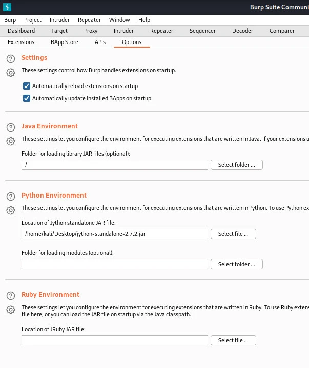
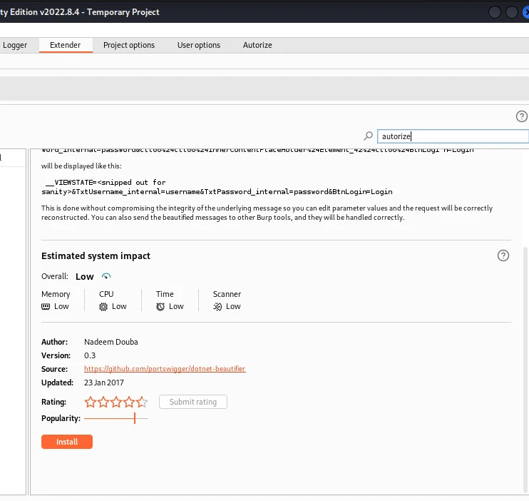
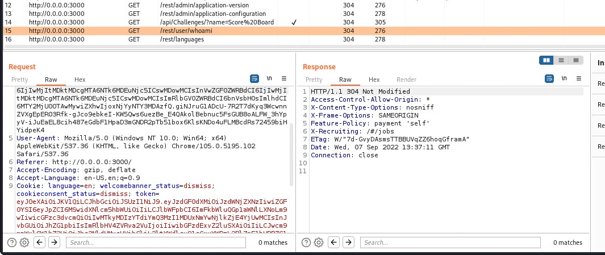
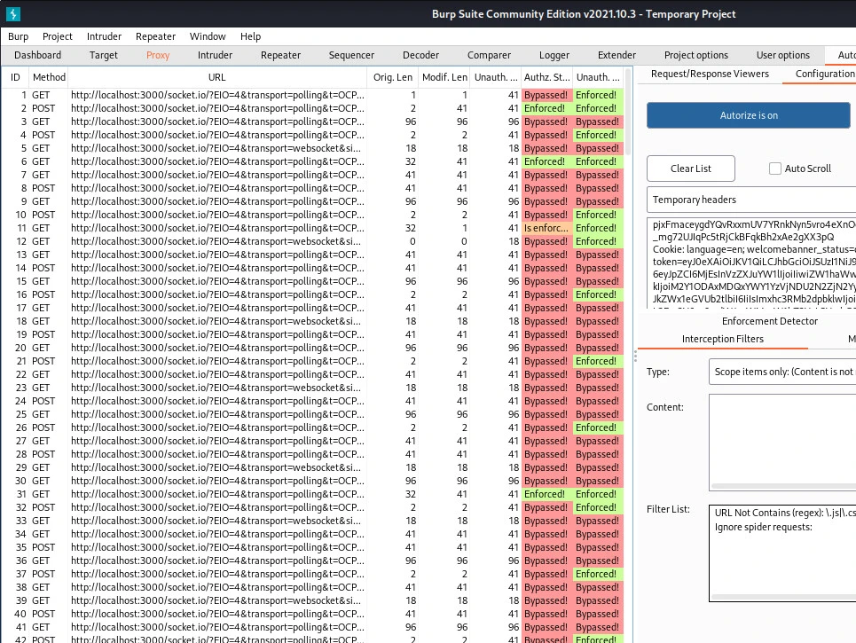

# 自动化 Web 缓存欺骗攻击实战教程 (Tutorial)

> **作者：** heuctf
> **发布日期：** 2026年4月10日
> **分类：** 安全 (Security)
> **核心标签：** `#security` `#automation` `#web-cache-deception`

---

## 01. 漏洞概述 (Overview)
互联网上仍有大量网站容易受到 **Web 缓存欺骗（Web Cache Deception）** 攻击。在这种攻击中，恶意行为者会“愚弄”Web 服务器，使其提供该行为者本无权访问的信息。

**场景示例：**
在一个简单的电子商务网站中，存在两类用户：**客户**和**管理员**。
* **正常逻辑：** 用户只能查看与其账号相关的订单，且无法访问受限页面。
* **攻击场景：** 在 Web 缓存欺骗攻击中，普通用户可以成功访问这些受限的行政或管理页面。

对于渗透测试人员来说，手动检查所有链接是一项极其繁琐且疲惫的工作。本指南将展示如何利用 **Burp Suite** 自动化检查这些漏洞链接。

---

## 02. 环境要求 (Requirements)
在开始之前，请确保具备以下条件：
* **Burp Suite:** 已安装（社区版即可）。
* **漏洞靶场:** 一个可供测试的漏洞网站。本指南将统一使用 **OWASP Juice Shop**（其他如 DVWA 或 Web Goat 亦可）。

---

## 03. 工具准备与配置 (Setup)

### 1. 安装 Burp Suite
在 Linux 系统上，下载安装程序并赋予执行权限：
```bash
cd ~/Downloads
chmod +x burpsuite_community_linuxv2022_8_4.sh
# 启动安装程序
./burpsuite_community_linux_v2022_8_4.sh
```
安装面板将引导你完成配置，Burp 会在此过程中自动检测系统环境是否满足运行需求。

### 2. 配置 Autorize 插件
**Autorize** 是我们实现自动化链接检查的核心插件。由于该插件基于 Python，我们需要先配置 **Jython** 环境：
1. 前往 Jython 下载页面下载 **Jython Standalone** 文件。

3. 在 Burp Suite 的 **Extender** 标签页中，选择该文件的存放位置进行关联。



4. 关联成功后，在 **BAppStore** 标签页中搜索并安装 **Autorize**。安装完成后，Burp 顶部会新增一个 Autorize 标签。

### 3. 部署 OWASP Juice Shop 靶场
我们将使用 Docker 运行容器化版本：
```bash
# 拉取镜像
docker pull bkimminich/juice-shop

# 运行容器（将 3000 端口映射至本地）
docker run --rm -p 3000:3000 bkimminich/juice-shop
```
启动后，通过浏览器访问 `0.0.0.0:3000` 即可进入靶场环境。

---

## 04. 攻击实施步骤 (Attack Steps)

确保一切配置就绪：漏洞应用正常运行、Burp Suite 已启动且代理（Proxy）设置正确（建议使用 Burp 内置浏览器）。

### 第一步：捕获低权限用户 Cookie
这是发起 Web 缓存欺骗攻击的基础。
1. 使用代理浏览器访问 Web 应用。
2. 以低权限账号浏览页面。
3. 在 Burp 的 HTTP history 中，你可以观察到发往 Web 应用的各种请求。


  
### 第二步：将凭证添加至 Autorize
1. 导航到 **Autorize** 标签页。
2. 找到 **Temporary headers** 文本框，在此添加低权限用户的 Cookies 和 Authorization 字段。
3. **自动化操作：** 点击下方的 **Fetch headers** 按钮即可自动填充。

![alt text(Picture4-4.webp)

4. **配置过滤器：** 在拦截过滤器中添加 `Scope items only`。
5. **开启检测：** 建议勾选 `check unauthenticated`。最后，点击 **"autorize is off"** 按钮将其切换为开启状态。

### 第三步：以高权限身份浏览
1. 返回 Web 应用程序，以**高权限（管理员）**身份登录。
2. 在网站的各个页面之间进行导航和操作。

---

## 05. 检查结果 (Results Analysis)
回到 **Autorize** 标签页，你可以看到自动检测的结果。下图中展示了已被识别为可绕过（Bypassed）的链接。




**核心逻辑：**
Autorize 会自动提取高权限用户的请求，并使用低权限用户的 Cookie 重新发起。这模拟了低权限用户手动测试链接的过程，但通过 Autorize 实现了全量自动化。


---

## 06. 结论 (Conclusion)
在本指南中，我们成功完成了针对目标网站的 Web 缓存欺骗攻击测试。
* **效率提升：** 使用 Autorize 插件替代了繁琐的手动检查，大幅节省了时间。
* **应用场景：** 该方法在漏洞赏金（Bug Bounty）狩猎中极为实用。
* **安全现状：** 目前互联网上仍有大量网站面临此类风险，掌握此类自动化测试工具对于安全研究至关重要。

---
